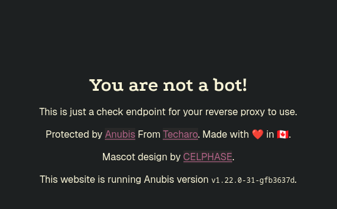

# Anubis: Web AI Firewall für Traefik

**Anubis** ist eine Web AI Firewall, die als leichtgewichtige Lösung entwickelt wurde, um deine Services vor unerwünschtem Bot-Traffic zu schützen.

## Was ist Anubis?

Anubis ist ein **Web AI Firewall Utility**, das die "Seele" deiner Verbindungen durch verschiedene Challenges überprüft, um nachgelagerte Ressourcen vor Scraper-Bots zu schützen. Das Programm wurde speziell entwickelt, um das Internet vor der endlosen Flut von Anfragen von AI-Unternehmen zu schützen.

### Wichtige Features:

- **Leichtgewichtig**: Minimaler Ressourcenverbrauch
- **Challenge-basiert**: Verschiedene Tests zur Bot-Erkennung
- **Konfigurierbar**: Allowlist für "gute Bots" wie Internet Archive
- **Traefik-kompatibel**: Einfache Integration als Middleware

> ⚠️ **Achtung**: Anubis ist eine ziemlich radikale Lösung. Dies führt dazu, dass deine Website von kleineren Scrapern blockiert wird und kann "gute Bots" wie das Internet Archive behindern.

---

## Grundvoraussetzung

- [Docker & Docker Compose v2](/posts/server-setup#5-docker-und-docker-compose)
- [Traefik Setup](/posts/traefik)

---

## Anubis in Traefik integrieren

Ich habe Anubis erstmal in meine `compose.yaml` vom traefik-stack selbst integriert.

```yaml
services:
  traefik:
    image: docker.io/library/traefik:latest
    container_name: traefik
    ports:
      - 80:80
      - 443:443
      # --> (Optional) aktiviere dashboard, don't do in production
      #- 8080:8080
      # <--
    volumes:
      - /run/docker.sock:/run/docker.sock:ro
      - ./config/traefik.yaml:/etc/traefik/traefik.yaml:ro
      - ./data/certs/:/var/traefik/certs/:rw
      - ./config/conf.d/:/etc/traefik/conf.d/:ro
      - ./plugin/geoblock:/plugins-local/src/github.com/PascalMinder/geoblock/
      - ./logs/:/var/log/traefik
    environment:
      - CF_DNS_API_TOKEN=${CF_DNS_API_TOKEN}
    labels:
      - "traefik.enable=true"
      - "traefik.http.routers.traefik.entrypoints=websecure"
      - "traefik.http.routers.traefik.rule=Host(`traefik.123.cloud`)"
      - "traefik.http.routers.traefik.tls=true"
      - "traefik.http.routers.traefik.tls.certresolver=cloudflare"
      - "traefik.http.routers.traefik.service=traefik"
      - "traefik.http.services.traefik.loadbalancer.server.port=8080"
      - "traefik.docker.network=frontend"
      - "traefik.http.routers.traefik.middlewares=tinyauth"
      # Anubis middleware definition
      - "traefik.http.middlewares.anubis.forwardauth.address=http://anubis:8080/.within.website/x/cmd/anubis/api/check"
    networks:
      - frontend
    restart: unless-stopped

  anubis:
    image: ghcr.io/techarohq/anubis:main
    container_name: anubis
    restart: unless-stopped
    environment:
      # Telling Anubis, where to listen for Traefik
      - BIND=:8080
      # Telling Anubis to do redirect — ensure there is a space after '='
      - 'TARGET= '
      # Specifies which domains Anubis is allowed to redirect to
      - REDIRECT_DOMAINS=anubis-test.123.cloud,
      # Should be the full external URL for Anubis (including scheme)
      - PUBLIC_URL=https://anubis.123.cloud
      # Should match your domain for proper cookie scoping
      - COOKIE_DOMAIN=123.cloud
      - DIFFICULTY=4
    networks:
      - frontend
    labels:
      - traefik.enable=true
      - traefik.docker.network=frontend
      - traefik.http.routers.anubis.rule=Host(`anubis.123.cloud`)
      - traefik.http.routers.anubis.entrypoints=websecure
      - traefik.http.services.anubis.loadbalancer.server.port=8080
      - traefik.http.routers.anubis.service=anubis
      - traefik.http.routers.anubis.tls.certresolver=cloudflare

  # Protected by Anubis
  target:
    image: traefik/whoami:latest
    container_name: target
    networks:
      - frontend
    labels:
      - traefik.enable=true
      - traefik.docker.network=frontend
      - traefik.http.routers.target.rule=Host(`anubis-test.123.cloud`)
      - traefik.http.routers.target.entrypoints=websecure
      - traefik.http.services.target.loadbalancer.server.port=80
      - traefik.http.routers.target.service=target
      - traefik.http.routers.target.tls.certresolver=cloudflare
      - traefik.http.routers.target.middlewares=anubis@docker


networks:
  frontend:
    external: true

```

> ⚠️ Anpassungen an der Domain vornehmen.

---

## Stack starten

Nun starten wir den Stack einfach nochmal durch

```
docker compose up -d --force-recreate
```

---

## Challenge-Verhalten prüfen

Du kannst nun erstmal die `anubis.123.cloud` Adresse ansurfen und solltest soetwas hier sehen.



Wenn hier keine Fehlermeldung auftaucht, sollte alles ordentlich konfiguriert sein.

Besuche jetzt deine `anubis-test.123.cloud` Website im Browser und überprüfe:
- JavaScript-Challenge wird geladen
- CAPTCHA erscheint bei verdächtigem Traffic
- Normale Benutzer können nach Challenge zugreifen

Du solltest jetzt dein Ziel mithilfe von Anubis von Scraper geschützt haben.

Das hier ist ein absolutes Basic Setup und Anubis bietet noch sehr viel mehr feintuning settings.
Das könnt ihr den Quellen entnehmen.

## Quellen

- [Anubis GitHub Repository](https://github.com/TecharoHQ/anubis)
- [Anubis Dokumentation](https://anubis.techaro.lol/)

