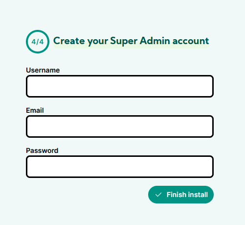
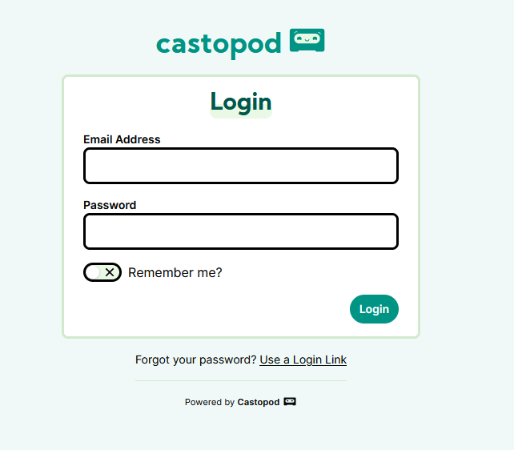
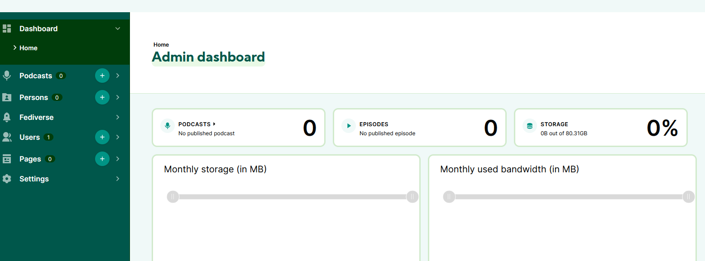

Castopod ist eine kostenlose und Open-Source-Software, mit der du deinen Podcast ganz einfach selbst hosten kannst.
Du behältst dabei die volle Kontrolle über deinen Content und deine Hörer:innen – ohne lästige Mittelsmänner oder Plattformen, die sich einmischen. Mit Castopod gehört dein Podcast wirklich dir, und du kannst direkt mit deiner Community interagieren. On top: Castopod bietet dir eine Integration ins Fediverse, sodass du deine Inhalte mit einem dezentralen Netzwerk teilen und eine noch engere Verbindung zu deiner Hörerschaft aufbauen kannst. Perfekt, um in die Welt des Podcasting 2.0 einzutauchen!

---

## 1. Grundvoraussetzung

- [Docker & Docker Compose v2](/posts/server-setup#5-docker-und-docker-compose)
- [Traefik Setup](/posts/traefik)

---

## 2. Verzeichnis erstellen

Dazu gebt ihr folgenden Befehl ein:
```shell
mkdir -p /opt/containers/castopod
```

---

## 3. Docker Compose Datei erstellen

Nun erstellen wir unsere Docker Compose Datei.

```shell title="compose.yml"
nano /opt/containers/castopod/compose.yml
```

**Fügt folgendes ein:**

```yaml
---
services:
  castopod:
    image: castopod/castopod:latest
    container_name: "castopod"
    volumes:
      - ./castopod-media:/var/www/castopod/public/media
    environment:
      MYSQL_DATABASE: castopod
      MYSQL_USER: castopod
      MYSQL_PASSWORD: changeme
      CP_BASEURL: "https://podcast.deinedomain.de"
      CP_ANALYTICS_SALT: changeme
      CP_CACHE_HANDLER: redis
      CP_REDIS_HOST: redis
      CP_REDIS_PASSWORD: changeme
    networks:
      - castopod
      - castopod-db
      - frontend
    labels:
      - "traefik.enable=true"
      - "traefik.http.routers.castopod.entrypoints=websecure"
      - "traefik.http.routers.castopod.rule=(Host(`podcast.deinedomain.de`))"
      - "traefik.http.routers.castopod.tls=true"
      - "traefik.http.routers.castopod.tls.certresolver=cloudflare"
      - "traefik.http.routers.castopod.service=castopod"
      - "traefik.http.services.castopod.loadbalancer.server.port=8000"
      - "traefik.docker.network=frontend"
    restart: unless-stopped

  mariadb:
    image: mariadb:11.2
    container_name: "castopod-mariadb"
    networks:
      - castopod-db
    volumes:
      - ./castopod-db:/var/lib/mysql
    environment:
      MYSQL_ROOT_PASSWORD: changeme
      MYSQL_DATABASE: castopod
      MYSQL_USER: castopod
      MYSQL_PASSWORD: changeme
    restart: unless-stopped

  redis:
    image: redis:7.2-alpine
    container_name: "castopod-redis"
    command: --requirepass changeme
    volumes:
      - ./castopod-cache:/data
    networks:
      - castopod
networks:
  castopod:
  castopod-db:
  frontend:
    external: true
```

**Notwendige Anpassungen:**

1. Ihr müsst noch den Hostnamen anpassen: (Host(`podcast.deinedomain.de`))"
2. 2x MYSQL_PASSWORD: changeme
3. CP_BASEURL: "https://podcast.deinedomain.de"
4. CP_ANALYTICS_SALT: changeme
5. CP_REDIS_PASSWORD: changeme
6. MYSQL_ROOT_PASSWORD: changeme

---

## 4. Castopod starten

Jetzt nur noch den Container starten. Gebt dazu folgendes ein:

```shell
docker compose -f /opt/containers/castopod/compose.yml up -d
```

Nun geht ihr auf `podcast.euredomain.de/cp-install` 
Dort solltet ihr jetzt folgendes sehen.



Jetzt erstellen wir noch Schreibrechte:

```shell
chmod 770 -R /opt/containers/castopod/castopod-media
```

Wir erstellen jetzt den Super Admin Account und können uns nun einloggen.



Und so sieht das Admin Dashboard aus:



Quelle:

https://docs.castopod.org/main/en/


