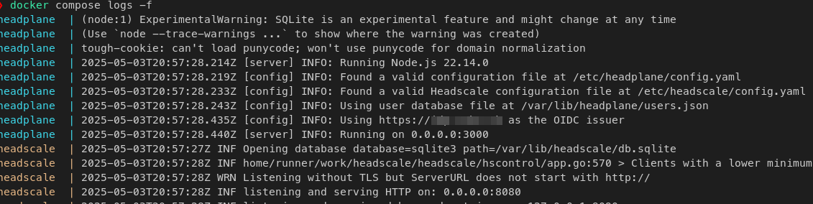
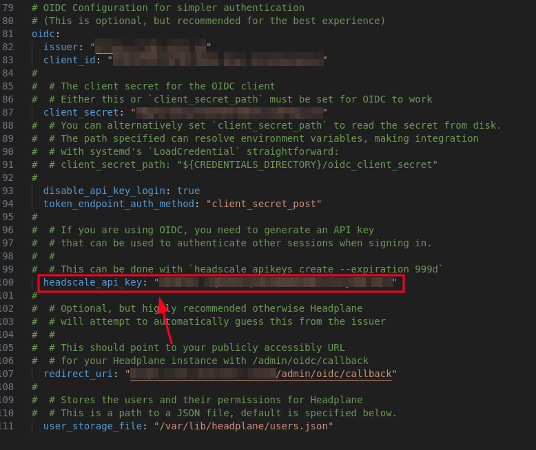
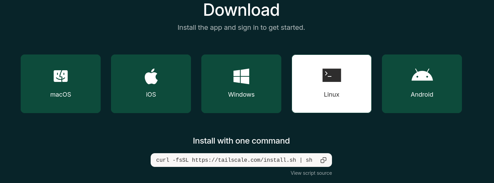
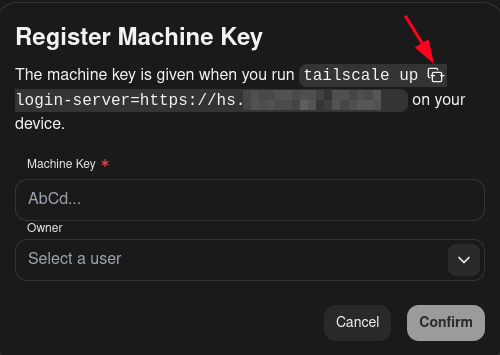
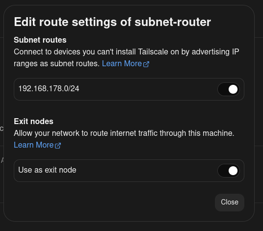

import Callout from '@/components/Callout.astro'

## 1. Intro 

Wie ich Traefik installiere und konfiguriere, habe ich ja bereits ausführlich beschrieben. Der wohl wichtigste Dienst neben Traefik ist Headscale.

Headscale ist eine selbstgehostete Open-Source-Implementierung des Tailscale-Kontrollservers.
Tailscale wiederum ist ein benutzerfreundliches VPN, das auf WireGuard basiert und eine einfache, sichere Netzwerkverbindung zwischen Geräten ermöglicht – ganz ohne komplizierte Konfigurationen. Es setzt auf eine Zero-Trust-Architektur, um den Netzwerkverkehr zu sichern, und erleichtert den Zugriff auf Ressourcen, unabhängig vom Standort der Nutzer.

In dieser Anleitung integrieren wir zusätzlich die Headplane-Web-UI und richten eine OIDC-Authentifizierung (OpenID Connect) ein.

---

### 1.1 Vorwort

**Begriffsdefinitionen**

Bevor wir ins Detail gehen, klären wir zunächst einige wichtige Begriffe:

* **WireGuard:** Ein modernes, extrem schnelles und sicheres VPN-Protokoll. Es ist die technische Basis, auf der sowohl Tailscale als auch Headscale aufbauen. WireGuard selbst stellt nur die verschlüsselte Verbindung zwischen Geräten her – ohne Benutzerverwaltung oder zentrale Steuerung.
* **Tailscale:** Ein kommerzieller VPN-Dienst, der auf WireGuard basiert und einen zentralen Kontrollserver nutzt, über den Geräte miteinander verbunden werden. Es ist super einfach einzurichten, aber du gibst die Kontrolle an Tailscale ab.
* **Headscale:** Eine Open-Source-Alternative zu Tailscale, mit der du deine eigene Tailscale-Instanz selbst hosten kannst.
* **Tailnet:** Das private Netzwerk, das durch Tailscale bzw. Headscale erstellt wird. Alle verbundenen Geräte innerhalb dieses Netzwerks können sicher miteinander kommunizieren.

---

### 1.2 Setup-Beschreibung

**Kritische Dienste nur per VPN erreichbar machen**

Ein großer Faktor für mich ist, Dienste mit SSL-Zertifikaten auszustatten – aber nur aus meinem eigenen VPN heraus erreichbar zu machen.
Mit Traefik, Headscale und der **DNS-01-Challenge** ist das zum Glück relativ einfach umsetzbar.

Ich mache das so:
Ich habe zwei Domains:

1. **mypublicserver.de**

2. **myprivateserver.de**

Auf **mypublicserver.de** laufen alle öffentlich erreichbaren Dienste – z.B. mein Identity Provider (Pocket-ID).

Auf **myprivateserver.de** liegt z.B. Vaultwarden – eine besonders kritische Anwendung, die nur für Nutzer im VPN erreichbar sein darf.

**SSH-Ports standardmäßig geschlossen**

Ein weiterer großer Vorteil: Ich kann mit **Headscale** auch mein SSH vollständig hinter das sichere VPN legen.

<Callout icon="💡" type="info">
<strong>Ein kurzes Beispiel:<br></br></strong>
Ich habe bei Hetzner einen kleinen VPS laufen. Dort ist der Port 22 in der Firewall komplett gesperrt – und trotzdem kann ich mich per Headscale-SSH auf den Server verbinden.
Das funktioniert genau wie gewohnt, nur dass ich nicht die öffentliche IP-Adresse nutze, sondern die interne Tailnet-IP.
Die Schlüsselpaarverwaltung übernimmt Headscale automatisch.
Ein absolut geniales Feature!
</Callout>

**Super einfacher WireGuard-Connect**

Noch ein großer Vorteil: Die einfache Einbindung neuer Geräte ins **Tailnet**.

Da **OIDC** (via Pocket-ID) integriert ist, genügt ein Kommandozeilenbefehl und ein Klick – und schon ist das Gerät ins Headscale / Tailnet / WireGuard-Netzwerk eingebunden.

Auch auf dem Desktop, Laptop oder Smartphone funktioniert das genauso komfortabel.

Zusätzlich sorgt **Pocket-ID** dafür, dass dein Headscale/VPN nur per **Passkey** zugänglich ist – was das Ganze nochmal deutlich sicherer (und cooler) macht.

---

## 2. Voraussetzungen

Bevor wir starten, stellt sicher, dass folgende Voraussetzungen erfüllt sind:

- [Docker & Docker Compose v2](/posts/server-setup#5-docker-und-docker-compose)
- [Traefik Setup](/posts/traefik)
- [Pocket ID](/posts/pocket-id)

---

## 3. Ordnerstruktur erstellen

```bash
mkdir -p /opt/containers/headscale/{headscale-data, headscale-config, headplane-data} 
```

### 3.1 Docker Compose Dateien

```bash
nano /opt/containers/headscale/docker-compose.yml
```

```yml title="docker-compose.yml"
services:
  headplane:
    # I recommend you pin the version to a specific release
    image: ghcr.io/tale/headplane:0.5.10
    container_name: headplane
    restart: unless-stopped
    volumes:
      - './config.yaml:/etc/headplane/config.yaml'
      # This should match headscale.config_path in your config.yaml
      - './headscale-config/config.yaml:/etc/headscale/config.yaml'

      # Headplane stores its data in this directory
      - './headplane-data:/var/lib/headplane'

      # If you are using the Docker integration, mount the Docker socket
      - '/var/run/docker.sock:/var/run/docker.sock:ro'
    labels:
      - "traefik.enable=true"
      - "traefik.http.routers.headplane.entrypoints=websecure"
      - "traefik.http.routers.headplane.rule=Host(`hs.myserver.de`) && PathPrefix(`/admin`)"
      - "traefik.http.routers.headplane.service=headplane"
      - "traefik.http.routers.headplane.tls=true"
      - "traefik.http.routers.headplane.tls.certresolver=cloudflare"
      - "traefik.http.services.headplane.loadbalancer.server.port=3000"
      - "traefik.docker.network=frontend"
    networks:
      - frontend
  headscale:
    image: headscale/headscale:0.25.1
    container_name: headscale
    restart: unless-stopped
    command: serve
    volumes:
      - './headscale-data:/var/lib/headscale'
      - './headscale-config:/etc/headscale'
    labels:
      - "traefik.enable=true"
      - "traefik.http.routers.headscale.entrypoints=websecure"
      - "traefik.http.routers.headscale.rule=Host(`hs.myserver.de`)"
      - "traefik.http.routers.headscale.service=headscale"
      - "traefik.http.routers.headscale.tls=true"
      - "traefik.http.routers.headscale.tls.certresolver=cloudflare"
      - "traefik.http.services.headscale.loadbalancer.server.port=8080"
      - "traefik.docker.network=frontend"
    networks:
      - frontend
networks:
  frontend:
    external: true
```

**Anpassen:**
* 2X -> - "traefik.http.routers.headscale.rule=Host(`hs.myserver.de`)"

---

### 3.2 Headscale Config

Um die aktuelle Headscale-Konfigurationsdatei zu erhalten, laden wir die Vorlage direkt aus dem Headscale GitHub-Repository herunter. Diese Datei wird als Basis dienen, um die notwendigen Anpassungen für unser Setup vorzunehmen.
```bash
sudo curl -o /opt/containers/headscale/headscale-config/config.yaml https://raw.githubusercontent.com/juanfont/headscale/refs/heads/main/config-example.yaml
```

Nun hast du die aktuelle Headscale-Konfigurationsdatei auf deinem Server gespeichert und kannst sie für deine Anforderungen anpassen.
```bash
nano /opt/containers/headscale/headscale/config/config.yaml
```

* server_url: https://hs.myserver.de
* listen_addr: 0.0.0.0:8080
* base_domain: headscale.domain.de -> darf nicht die server url sein
* policy -> mode: database ->  für die ACL
* oidc: issuer, client id, client secret, domain_hint, pkce


Auf der [Pocket ID](https://pocket-id.org/docs/client-examples/headscale/) Seite gibt es eine genau Anleitung dafür.


Die beiden Domains hs.domain.de und headscale.domain.de sollten beide per A-Record auf eure Server-IP zeigen.

---

### 3.3 Headplane config

Um die aktuelle Headplane-Konfigurationsdatei zu erhalten, laden wir die Vorlage direkt aus dem Headplane GitHub-Repository herunter. Diese Datei wird als Basis dienen, um die notwendigen Anpassungen für unser Setup vorzunehmen.
```bash
sudo curl -o /opt/containers/headscale/config.yaml https://raw.githubusercontent.com/tale/headplane/refs/heads/main/config.example.yaml
```

```bash
nano /opt/containers/headscale/config.yaml
```

* cookie_secret: "change_me_to_something_secure!"
* url: "https://hs.myserver.de"
* oidc: issuer, client, secret, api (besorgen wir uns gleich), redirect_uri

---

## 4. Starte den Container

Wir starten die Container mit diesem Befehl:

```bash
docker compose -f /opt/containers/headscale/docker-compose.yml up -d
```

---

### 4.1 Docker Logs auslesen

Nun, da alles im Hintergrund läuft, sollten wir kurz die Logs überprüfen, um sicherzustellen, dass alles korrekt funktioniert.

```bash
docker compose -f /opt/containers/headscale/docker-compose.yml logs -f
```

Bei mir sieht es so aus:




---

## 5. Web GUI

Nun sollte dein Headscale-Server erfolgreich laufen. Als nächstes greifen wir auf das Headplane User Interface zu. Dieses User Interface befindet sich zwar noch in einer frühen Alpha-Phase, ist jedoch schon gut nutzbar. Sollten Probleme auftreten, können wir immer auf die CLI zurückgreifen, was die Situation weniger kritisch macht.

Wenn du bereits Tailscale genutzt hast, wirst du dich in dieser Umgebung schnell zurechtfinden, da das Interface stark an das originale Tailscale Web-GUI erinnert.

---

### 5.1 API Key generieren

Um das Headplane UI nutzen zu können, benötigen wir zunächst einen API Key für die Authentifizierung. Diesen Key erstellen wir mit dem folgenden Befehl:

Führe den folgenden Befehl auf deinem Server aus, um einen neuen API Key zu generieren:

```bash
docker exec headscale headscale apikeys create --expiration 24h
```

Mit dem API Key könnt ihr euch nun unter `hs.myserver.de/admin/` einloggen **der zweite / am Ende ist in der Version 0.5.10 Pflicht.*

Jetzt besorgen wir uns noch einen API Key für OIDC mit diesem Befehl:

```bash
docker exec headscale headscale apikeys create --expiration 999d
```

Den API Key setzen wir jetzt hier ein und setzen `disable_api_key_login: true`.

```bash
nano /opt/containers/headscale/config.yaml
```



Nun die Container neustarten:

```bash
docker compose -f /opt/containers/headscale/docker-compose.yml restart
```

---


## 6. Geräte / Clients hinzufügen

Jetzt, wo der gesamte Setup-Prozess abgeschlossen ist, kannst du den großen Vorteil dieses Setups nutzen: Mit nur wenigen Klicks lassen sich verschiedene Geräte wie PCs, Macs, Server, Smartphones und mehr in dein WireGuard VPN integrieren. 

Zudem können über Traefik ganz einfach SSL-Zertifikate generiert werden, um sicherzustellen, dass deine Dienste nur über das VPN erreichbar sind und gleichzeitig verschlüsselt übertragen werden.

---

### 6.1 Linux Client

Der Tailscale Client ist Opensource und für alle gängigen Plattformen verfügbar.

[Download Tailscale](https://tailscale.com/download)



Auf meinem Fedora Desktop öffne ich die Konsole und kopiere folgendes rein:

```bash
curl -fsSL https://tailscale.com/install.sh | sh
```

Danach gehe ich auf `hs.myserver.de/admin/` klicke oben rechts auf `Add Device` -> `Register Machine`.



Kopiere den Befehl:

```bash
tailscale up --login-server=https://hs.myserver.de
```

Dann öffnen ich den angezeigten Link für OIDC, Logge mich mit meinem Passkey ein und fertig.

Unter Windows würde das wohl genauso klappen, nur nimmt man dann wohl die Powershell und unter macOS - damit kenne ich mich nicht aus.

---

### 6.2 Android Client

Lade den offiziellen Tailscale Android-Client aus dem [Google Play Store](https://play.google.com/store/apps/details?id=com.tailscale.ipn&pli=1) oder [F-Droid](https://f-droid.org/packages/com.tailscale.ipn/) herunter und installiere ihn.

---

#### 6.2.1 Headscale-URL konfigurieren

Öffne die Tailscale-App und gehe zum Einstellungsmenü (oben rechts).
Wähle Accounts.

Tippe oben rechts auf das Kebab-Menü (die drei Punkte).
Wähle Use an alternate server.

Gib die URL deines Headscale-Servers ein, z. B. https://hs.myserver.de.

Folge den Anweisungen auf dem Bildschirm, um die Verbindung herzustellen.

Für iOS erspare ich mir die erklärung da es quasi genauso geht, ich aber auch kein Gerät zum testen hier habe.

---

## 7. Dienste mit SSL erreichbar machen

Headscale bietet von Haus aus die Magic DNS Funktion an wodurch jedem Gerät eine eindeutige Domain zugewiesen wird, allerdings unterstützt bis jetzt noch keine DNS01 Challenge.

Traefik sorgt dafür, dass deine internen Dienste verschlüsselt und nur via VPN erreichbar sind, und zwar durch die Nutzung der DNS-01-Challenge mit Cloudflare. Dabei werden für alle deine Dienste automatisch SSL-Zertifikate ausgestellt.

**Headscale/Traefik Server ins Mesh-VPN einbinden**

Es ist wichtig, dass auch dein Headscale/Traefik Server im Headscale-Mesh-VPN eingebunden ist. Andernfalls wird der nächste Schritt, bei dem SSL-Zertifikate für deine internen Dienste ausgestellt werden und der Zugriff via VPN erfolgt, nicht funktionieren.

**Warum ist das wichtig?**

Der Headscale-Server selbst muss Teil des Mesh-Netzwerks sein, um die Kommunikation zwischen den Geräten sicherzustellen und die internen Dienste über das VPN erreichbar zu machen. Nur so kann sichergestellt werden, dass alle Geräte – einschließlich des Headscale- und Traefik-Servers – über das VPN miteinander kommunizieren können.

Um dein Setup zu testen und sicherzustellen, dass alles wie geplant funktioniert, kannst du einen A-Record bei Cloudflare anlegen, der auf die VPN-IP deines Headscale/Traefik-Servers zeigt.

In diesem Fall verwenden wir die VPN-IP-Adresse, die der Headscale-Server über Tailscale erhalten hat.

Bei mir läuft der Server auf `100.64.0.1 -> headscale-traefik-server`

---

### 7.1 Warum die VPN-IP verwenden?

Die Verwendung der VPN-IP ist entscheidend, denn sie fungiert als VPN-Reverse-Proxy. Das bedeutet, dass alle Anfragen, die an den von dir konfigurierten DNS-Namen gesendet werden, über das VPN an deinen Headscale/Traefik-Server weitergeleitet werden. Auf diese Weise kannst du SSL-Zertifikate für deine internen Dienste ausstellen, selbst wenn diese nur im internen Netzwerk verfügbar sind. So erreichst du zwei wichtige Ziele:

1. Sicherheit: Deine internen Dienste sind nur über das VPN erreichbar, und die Kommunikation ist durch SSL verschlüsselt.
2. Zugriffskontrolle: Nur Geräte, die über das VPN verbunden sind, haben Zugriff auf diese Dienste.

Das heißt bei meinem Setup folgendes:

Ich habe eine Domain für interne Dienste `myprivateserver.de` hier setze ich ein Wildcardeintrag in Cloudflare für die IP `100.64.0.1`.

Und für `mypublicserver.de` hier läuft das Wildcard Zertifakt über mein [DynDNS](/blog/dyndns). 

Also kann ich einfach über das traefik-label `- "traefik.http.routers.headscale.rule=Host(`private oder public domain.de`)"` entscheiden, ob dieser Dienst intern oder extern erreichbar sein soll.

Das finde ich wirklich super simpel praktisch.

---

## 8. Exit Nodes und Subnet Routes

### 8.1 Was sind Exit Nodes?

Um nicht nur ein reines VPN zu haben, sondern auch den gesamten Internetverkehr eines Geräts über eine bestimmte IP-Adresse zu routen, können wir einen der Tailscale-Clients als Exit Node einrichten. Eine Exit Node ermöglicht es, den öffentlichen Internetverkehr eines Geräts sicher durch ein anderes Gerät im Netzwerk zu leiten.

Das bedeutet, dass der gesamte Traffic – sowohl interner als auch externer Internetverkehr – über die IP des Exit Nodes geroutet wird.

Um ein ein Gerät zu verbinden und es selbst zur Exit Node zu machen:
```bash
tailscale up --login-server https://hs.myserver.de --advertise-exit-node
```
Wenn das Gerät bereits verbunden ist kannst du die Exit Node ganz einfach so setzen:
```bash
tailscale set --advertise-exit-node
```

Jetzt sagen wir dem Betriebssystem noch das wir wirklich den Traffic weiterleiten wollen.
```bash
echo 'net.ipv4.ip_forward = 1' > /etc/sysctl.d/99-vpn.conf
echo 'net.ipv6.conf.all.forwarding = 1' >> /etc/sysctl.d/99-vpn.conf
sysctl -p /etc/sysctl.d/99-vpn.conf
```

In der Headplane UI muss dann noch ein Haken gesetzt werden unter `Machines->Node->Review`




### 8.2 Was sind Subnet Routes?

In manchen Fällen ist es nicht möglich oder sinnvoll, den Tailscale-Client auf jedem Gerät in einem Netzwerk zu installieren, z.B. bei Druckern oder IOT. Hier kommt der Subnet Router ins Spiel.
Ein Subnet Router agiert als Gateway und ermöglicht es, Geräte im Netzwerk (ohne Tailscale-Installation) über das Tailscale-Netzwerk (Tailnet) zu erreichen.

Nachdem du IP-Forwarding aktiviert hast, kannst du Tailscale mit dem `--advertise-routes-Flag` konfigurieren, um Subnetze in deinem Netzwerk zu eröffnen. Das Kommando sieht folgendermaßen aus:
```bash
tailscale up --advertise-routes=192.0.2.0/24,198.51.100.0/24
```
Ersetze die Beispiel-Subnetze durch die richtigen für dein Netzwerk.

Auf Android, iOS, macOS, tvOS und Windows werden neue Subnet-Routen automatisch erkannt und genutzt.

Standardmäßig sehen Linux-Geräte nur Tailscale-IP-Adressen. Um auf Linux-Geräten die automatische Erkennung neuer Subnet-Routen zu aktivieren, starte Tailscale mit dem `--accept-routes`-Flag:
```bash
tailscale up --accept-routes
```
Mit Tailscale kannst du Subnet-Router einrichten, um Subnetze zu bewerben und damit den Zugriff auf Netzwerkinfrastrukturen zu ermöglichen, ohne Tailscale auf jedem Gerät installieren zu müssen.

### 8.3 Erfahrungen mit Subnet-Routes

Man könnte leicht einen ganzen Artikel über Subnet-Router schreiben, aber hier reiße ich das Thema nur kurz an. Wenn du dich tiefer damit beschäftigen möchtest, findest du alle Details in der offiziellen Tailscale-Dokumentation:

[Tailscale Documentaion](https://tailscale.com/kb/1019/subnets)

Ich persönlich nutze Subnet-Routes, um zum Beispiel meinen Drucker ins Tailnet einzubinden.

Meine Erfahrungen mit der Tailscale-App auf Android zeigen jedoch, dass sie sehr energieintensiv sein kann. Bei durchgehender Nutzung (24/7) war die App bei mir der Hauptverbraucher und hat die Akkulaufzeit meines Geräts stark reduziert.

Um das Problem zu lösen, habe ich folgenden Ansatz gewählt:  Auf meinem Hetzner Server habe ich einen WG-Easy-Container installiert, der Teil meines Tailnets ist. Durch die Verwendung eines Subnet-Routers in meinem Heimnetzwerk `(--advertise-routes=192.168.178.0/24)` und der Aktivierung dieser Route auf dem Hetzner-Server `(--accept-routes)`, kann ich mich nun über die WireGuard-App ins Tailnet einwählen.

Das spart enorm viel Akku, da die WireGuard-App hervorragend optimiert ist. 

**Ein zusätzlicher Tipp:** Noch besser als die offizielle WireGuard-App finde ich [WG Tunnel](https://github.com/wgtunnel/wgtunnel). Diese App ist über F-Droid und den Play Store verfügbar und liefert eine ausgezeichnete Nutzererfahrung.

Dieser Ansatz bietet eine energieeffiziente Lösung für die Nutzung von Tailscale auf mobilen Geräten.

---

## 9. Headscale SSH

Um die Vorteile von Headscale SSH voll auszuschöpfen, müssen wir einmal in der Headplane-UI unter `Access Control` Folgendes eintragen:
```json
    {
  "acls": [
    {
      "action": "accept",
      "src": ["*"],
      "dst": ["*:*"]
    }
  ],
  "ssh": [
    {
      "action": "accept",
      "src": ["*"],
      "dst": ["*"],
      "users": ["*"]
    }
  ]
}
```

Mit diesen Einstellungen ist nun auch Headscale SSH möglich. Das bedeutet, ihr könnt euch per SSH mit euren Maschinen verbinden, ohne vorher SSH-Keys austauschen zu müssen – vorausgesetzt, ihr befindet euch im Tailnet.

Die bestehende SSH-Konfiguration `(/etc/ssh/sshd_config)` sowie die Schlüsseldateien `(~/.ssh/authorized_keys)` bleiben dabei unverändert. Das heißt, andere SSH-Verbindungen zum selben Host, die nicht über Tailscale laufen, funktionieren weiterhin wie gewohnt.

Um Headscale SSH zu aktivieren, führt folgenden Befehl aus:
```bash
tailscale up --ssh
``` 
Dieses Flag muss auf jedem Server gesetzt werden, der per SSH erreichbar sein soll.

## 10. Schlusswort

So ähnlich habe ich mein Setup schon mal auf [goneuland.de](https://goneuland.de) beschrieben – dort allerdings noch mit Caddy als Reverse-Proxy. Ich habe viele Anleitungen von dort durchgearbeitet und viel gelernt. Die Grundvoraussetzung dort ist jedoch ein Traefik-Stack, der keine `dns-01`-Challenge unterstützt. Deshalb habe ich hier mein eigenes Traefik-Setup beschrieben und diese Anleitung entsprechend angepasst.

Die Anleitung ist ziemlich umfassend und lang. Ich hoffe, ich konnte alles verständlich rüberbringen – über Feedback freue ich mich!
