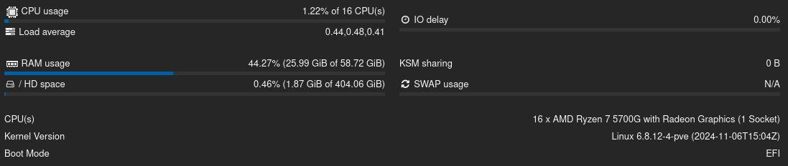

## 1. Mein Homelab-Setup

Meine Homelab-Hardware ist langsam aber sicher in die Jahre gekommen.  
Mein Intel® Core™ i5-7400 CPU ist mittlerweile acht Jahre alt. Seit mindestens fünf Jahren läuft bei mir zu Hause ein DeskMini mit genau diesem Prozessor, 16 GB RAM und 512 GB NVMe-Speicher für Proxmox. Zusätzlich sind zwei 1-TB-SATA-SSDs als ZFS-Mirror-RAID eingebaut.

Das Teil läuft immer noch problemlos – einzig die BIOS-Batterie ist inzwischen leer. Aber es ist einfach an der Zeit für etwas mehr Rechenleistung.

---

## 2. Das neue Setup

Da ich mit dem Formfaktor sehr zufrieden war, bin ich dem DeskMini treu geblieben – diesmal in der **X300-Variante mit AM4-Sockel**:

- **CPU:** AMD Ryzen 7 5700G mit Radeon Graphics  
- **RAM:** 64 GB  
- **System-Storage:** 2× 512 GB SSD im ZFS-Mirror für Proxmox  
- **Shared-Storage:** 2× 1 TB SATA-SSDs im ZFS-Mirror als NFS-Volume

---

## 3. Dienste & Infrastruktur

Da ich nicht einfach nur mein Backup rüberziehen und weitermachen möchte wie bisher, sondern alles **neu und bewusst anders** aufsetzen will, nutze ich die Gelegenheit, mein Setup hier etwas genauer zu beschreiben.

Aktuell läuft auf dem neuen Homelab eine **Ubuntu 24.04-VM mit Docker** und folgenden Diensten:

- [**Traefik**](/posts/traefik) (Reverse Proxy mit Cloudflare DNS-01-Challenge)  
- [**Pocket-ID**](/posts/pocket-id)
- **Jellyfin**  
- **Forgejo**  
- **TinyAuth**  
- **Portainer**  
- **Pingvin Share**  
- **Headscale + Headplane UI**  
- **AppFlowy Cloud**  
- **WG-Easy**  
- **Memos**  
- **IT-Tools**  
- **Collabora**  
- **Paperless**  
- **Audiobookshelf**  
- **Gotify**  
- **Vaultwarden**  
- **Homepage**  
- [**Seafile**](/posts/seafile) 
- [**Immich**](/posts/immich)   
- **KitchenOwl**  
- **DynDNS**

Mein Ziel ist es, für einige dieser Anwendungen meinen **konkreten Use Case und den Einrichtungsprozess** zu dokumentieren.

---

## 4. 1TB Storage – reicht das?

Gerade beim Thema Speicherplatz habe ich lange überlegt, ob 1 TB wirklich ausreicht.  
Meine Antwort: **Ja, für mein Setup reicht das völlig.**

Die datenhungrigen Dienste wie z. B. **Jellyfin** nutze ich hauptsächlich als Musikdatenbank – ich bin kein großer Movie-Junkie.

Und was meinen **Seafile-Sync-Server** betrifft: Damit ich nicht in Platzprobleme gerate, falls auch Familienmitglieder oder Freunde dort größere Datenmengen hochladen, liegt der Speicher hier in Form eines **S3-Objektspeichers bei Hetzner** – und wächst bei Bedarf einfach mit.

---

## 5. Proxmox – auch nur für eine VM sinnvoll?

Wenn du jetzt denkst:  
**„Warum sollte ich Proxmox installieren, wenn ich nur eine einzige VM mit Docker und Traefik laufen lasse – und sonst nichts?“**,  
dann ist die Antwort ganz einfach:

Es gibt **kein besseres und einfacheres Backup-System** als das über Proxmox.

Mit einem Klick kannst du die komplette VM sichern und bei einer Fehlkonfiguration das Backup jederzeit problemlos wieder einspielen.

Wenn du zusätzlich den **dedizierten Proxmox Backup Server** installierst, werden die Backups **dedupliziert und optional offsite gespeichert**.  
Das ist nicht nur einfach – sondern auch **extrem praktisch und zuverlässig**.

---

In den nächsten Beiträgen geht’s tiefer in die einzelnen Dienste, die Einrichtung und Best Practices für ein effizientes Homelab!

