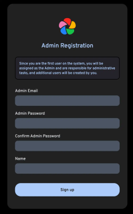

## 1. Intro

Immich ist für mich die Lösung, wenn es darum geht, meine Fotos in der Cloud zu organisieren und zu verwalten. 
Außerdem dient es mir als Backup meiner Fotos und Videos. Immich die open-source-Selfhosted-Foto- und Video-Plattform, 
die mich völlig überzeugt hat und jeden Tag bei mir im Einsatz ist. 

Es gibt all die Funktionen, die man von den großen Cloud-Anbietern 
kennt, aber ohne den bitteren Beigeschmack, dass ich eigentlich nicht weiß, was Google und co. sonst noch so mit meinen Daten machen.

Das Projekt ist in ständiger Weiterentwicklung, es kommen teilweise täglich, neue Updates und Features hinzu und da es Open-Source ist, 
kann ich mich auch daran beteiligen und neue Features entwickeln oder vorschlagen. 

Die Installation ist mit Docker ziemlich schnell gemacht, also legen wir los.

---

## 2. Voraussetzungen

Bevor wir starten, stellt sicher, dass folgende Voraussetzungen erfüllt sind:

- [Docker & Docker Compose v2](/posts/server-setup#5-docker-und-docker-compose)
- [Traefik Setup](/posts/traefik)

---

## 3. Projektverzeichnis erstellen

Beginnen wir damit, ein Projektverzeichnis zu erstellen, in dem alle Konfigurationsdateien liegen:

```bash
mkdir /opt/containers/immich
cd /opt/containers/immich
```

---

## 4. Projektdateien erstellen

Wir laden uns die aktuellste Verion der `.env` herunter.

```shell
wget -O .env https://github.com/immich-app/immich/releases/latest/download/example.env
```

Passe die `.env` entsprechend an, kannst zb. mit `UPLOAD_LOCATION` wählen wo deine Fotos gespeichert werden sollen.

 TZ= (Timezone) solltest du auf `Europe/Berlin` setzen

Außerdem müssen wir die `docker-compose.yml` noch erstellen

```shell
nano docker-compose.yml
```

```yaml title="docker-compose.yaml"

name: immich

services:
  immich-server:
    container_name: immich_server
    image: ghcr.io/immich-app/immich-server:${IMMICH_VERSION:-release}
    # extends:
    #   file: hwaccel.transcoding.yml
    #   service: cpu # set to one of [nvenc, quicksync, rkmpp, vaapi, vaapi-wsl] for accelerated transcoding
    volumes:
      # Do not edit the next line. If you want to change the media storage location on your system, edit the value of UPLOAD_LOCATION in the .env file
      - ${UPLOAD_LOCATION}:/usr/src/app/upload
      - /etc/localtime:/etc/localtime:ro
    env_file:
      - .env
    ports:
      - '2283:2283'
    depends_on:
      - redis
      - database
    labels:
      - "traefik.enable=true"
      - "traefik.http.routers.immich.entrypoints=websecure"
      - "traefik.http.routers.immich.rule=(Host(`immich.deinedomain.de`))"
      - "traefik.http.routers.immich.tls=true"
      - "traefik.http.routers.immich.tls.certresolver=cloudflare"
      - "traefik.http.routers.immich.service=immich"
      - "traefik.http.services.immich.loadbalancer.server.port=2283"
      - "traefik.docker.network=frontend"
    restart: unless-stopped
    networks:
      - immich
      - frontend
    healthcheck:
      disable: false

  immich-machine-learning:
    container_name: immich_machine_learning
    # For hardware acceleration, add one of -[armnn, cuda, openvino] to the image tag.
    # Example tag: ${IMMICH_VERSION:-release}-cuda
    image: ghcr.io/immich-app/immich-machine-learning:${IMMICH_VERSION:-release}
    # extends: # uncomment this section for hardware acceleration - see https://immich.app/docs/features/ml-hardware-acceleration
    #   file: hwaccel.ml.yml
    #   service: cpu # set to one of [armnn, cuda, openvino, openvino-wsl] for accelerated inference - use the `-wsl` version for WSL2 where applicable
    volumes:
      - model-cache:/cache
    env_file:
      - .env
    restart: always
    healthcheck:
      disable: false
    networks:
      - immich

  redis:
    container_name: immich_redis
    image: docker.io/redis:6.2-alpine@sha256:eaba718fecd1196d88533de7ba49bf903ad33664a92debb24660a922ecd9cac8
    healthcheck:
      test: redis-cli ping || exit 1
    restart: always
    networks:
      - immich

  database:
    container_name: immich_postgres
    image: docker.io/tensorchord/pgvecto-rs:pg14-v0.2.0@sha256:90724186f0a3517cf6914295b5ab410db9ce23190a2d9d0b9dd6463e3fa298f0
    environment:
      POSTGRES_PASSWORD: ${DB_PASSWORD}
      POSTGRES_USER: ${DB_USERNAME}
      POSTGRES_DB: ${DB_DATABASE_NAME}
      POSTGRES_INITDB_ARGS: '--data-checksums'
    volumes:
      # Do not edit the next line. If you want to change the database storage location on your system, edit the value of DB_DATA_LOCATION in the .env file
      - ${DB_DATA_LOCATION}:/var/lib/postgresql/data
    healthcheck:
      test: >-
        pg_isready --dbname="$${POSTGRES_DB}" --username="$${POSTGRES_USER}" || exit 1;
        Chksum="$$(psql --dbname="$${POSTGRES_DB}" --username="$${POSTGRES_USER}" --tuples-only --no-align
        --command='SELECT COALESCE(SUM(checksum_failures), 0) FROM pg_stat_database')";
        echo "checksum failure count is $$Chksum";
        [ "$$Chksum" = '0' ] || exit 1
      interval: 5m
      start_interval: 30s
      start_period: 5m
    command: >-
      postgres
      -c shared_preload_libraries=vectors.so
      -c 'search_path="$$user", public, vectors'
      -c logging_collector=on
      -c max_wal_size=2GB
      -c shared_buffers=512MB
      -c wal_compression=on
    restart: always
    networks:
      - immich

volumes:
  model-cache:
networks:
  frontend:
    external: true
  immich:

```

Hier müssen wir noch die Domain anpassen: `- "traefik.http.routers.immich.rule=(Host(`immich.deinedomain.de`))"`

 ---

 ## 5. Container starten

Jetzt können wir den Container starten

```yaml
docker compose up -d
```
Wenn alles geklappt hat, sollte dich auf deiner immich-Domain der Login-Screen begrüßen, hier kannst du dir initial ein Admin-Konto anlegen.



---

## 6. App installieren

Jetzt kannst du dir die Imich-App auf dein Smartphone laden und deine Fotos synchronisieren."
<div style={{ display: 'flex', justifyContent: 'left', gap: '10px' }}>
  <a href="https://play.google.com/store/apps/details?id=app.alextran.immich">
    
  </a>
  <a href="https://f-droid.org/packages/app.alextran.immich/">
    
  </a>
  <a href="https://apps.apple.com/us/app/immich/id1613945652">
    
  </a>
<a href="https://github.com/immich-app/immich/releases">
  
</a>
</div>

**Quellen:**

[Immich Dokumentation](https://immich.app/docs/install/docker-compose)