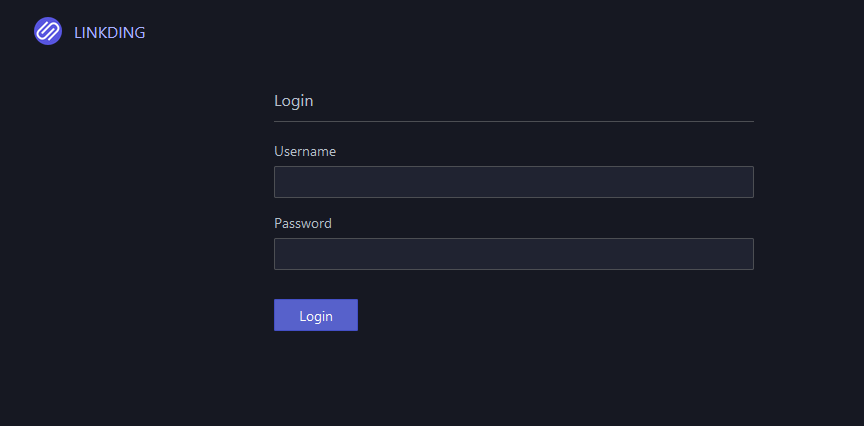
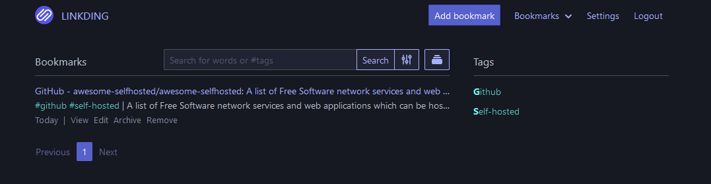
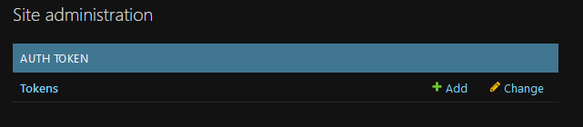

## Linkding – Mein persönlicher Bookmark-Manager zum Selbsthosten

[**Linkding**](https://github.com/sissbruecker/linkding) ist ein selbst gehosteter Bookmark-Manager – minimalistisch, schnell, einfach per Docker aufgesetzt. 

Bookmark-Manager gibt es wie Sand am Meer – ähnlich wie Notiz-Apps. Aber im Gegensatz zu meiner langen Suche bei den Notes bin ich bei den Bookmarks **schon seit Langem bei Linkding gelandet** – und ehrlich: Ich bin rundum happy damit.

In diesem Beitrag zeige ich euch, warum das so ist – und wie ihr **Linkding selbst hosten** könnt.

* * *

### Warum Linkding?

Vor ein paar Wochen ging die Meldung rum, dass Mozilla das [**Pocket-Projekt einstampft**](https://support.mozilla.org/en-US/kb/future-of-pocket). Und plötzlich wurde in vielen Blogs und Subreddits wieder diskutiert, wie ein guter Bookmarking-Dienst heute eigentlich aussehen sollte.

Für mich war die Antwort sofort klar:  
**Open Source, selfhosted, plattformübergreifend – und sinnvoll in der Bedienung.**  
Linkding erfüllt genau das.

Bei mir läuft ein Linkding-Server, natürlich via Docker und **Traefik als Reverse frontend** – und sorgt dafür, dass meine Bookmarks zentral verwaltet sind und ich sie von überall aus erreichen kann. Schnell, zuverlässig und ohne proprietären Overhead.

* * *

### Linkding-Features, die ich täglich nutze

*   **Browser-Plugin**: Mit einem Hotkey neue Lesezeichen hinzufügen – schneller geht’s nicht.
*   **Prefix-Suche direkt aus der Adresszeile**: Beispiel: `ld Suchbegriff` – und schon durchsuchst du deine Bookmarks.
*   **Öffentliche Bookmarks anzeigen**: Optional lassen sich bestimmte Bookmarks öffentlich zugänglich auf der Basis-Domain darstellen.
*   **Mobile Nutzung**: Auf meinem Android-Smartphone nutze ich die [**Linkdy App**](https://github.com/JGeek00/linkdy), um meine Bookmarks auch unterwegs sauber im Griff zu behalten. Funktioniert super.

---

#### Versionierung
Datum | Änderung
--|--
08-06-2025| Initialer Release

---

## Voraussetzungen

Bevor wir starten, stellt sicher, dass folgende Voraussetzungen erfüllt sind:

- [Docker & Docker Compose v2](/posts/server-setup#5-docker-und-docker-compose)
- [Traefik Setup](/posts/traefik)

---

## Ordner anlegen

Zuerst legen wir uns passende Ordner-Strukturen an.

```
mkdir -p /opt/containers/linkding
```

---

## Compose Datei anlegen

```
nano /opt/containers/linkding/compose.yml
```

```yaml title="compose.yml"
services:
  linkding:
    container_name: "${LD_CONTAINER_NAME:-linkding}"
    image: sissbruecker/linkding:latest
    volumes:
      - "${LD_HOST_DATA_DIR:-./data}:/etc/linkding/data"
    env_file:
      - .env
    restart: unless-stopped

    labels:
      - "traefik.enable=true"
      - "traefik.http.routers.linkding.entrypoints=websecure"
      - "traefik.http.routers.linkding.rule=Host(`linkding.yourdomain.org`)"
      - "traefik.http.routers.linkding.tls=true"
      - "traefik.http.routers.linkding.tls.certresolver=cloudflare"
      - "traefik.http.routers.linkding.service=linkding"
      - "traefik.http.services.linkding.loadbalancer.server.port=9090"
      - "traefik.docker.network=frontend"
    networks:
      - frontend
networks:
  frontend:
    external: true
```

**Noch anzupassen:**

> Eure Traefik URL: Host(linkding.yourdomain.org)

---

## .ENV Datei anlegen
```
nano /opt/containers/linkding/.env  
``` 

```env
# Docker container name
LD_CONTAINER_NAME=linkding
# Port on the host system that the application should be published on
LD_HOST_PORT=9090
# Directory on the host system that should be mounted as data dir into the Docker container
LD_HOST_DATA_DIR=./data

# Can be used to run linkding under a context path, for example: linkding/
# Must end with a slash `/`
LD_CONTEXT_PATH=
# Username of the initial superuser to create, leave empty to not create one
LD_SUPERUSER_NAME=user
# Password for the initial superuser, leave empty to disable credentials authentication and rely on proxy authentication instead
LD_SUPERUSER_PASSWORD=password
# Option to disable background tasks
LD_DISABLE_BACKGROUND_TASKS=False
# Option to disable URL validation for bookmarks completely
LD_DISABLE_URL_VALIDATION=False
# Enables support for authentication proxies such as Authelia
LD_ENABLE_AUTH_PROXY=False
# Name of the request header that the auth proxy passes to the application to identify the user
# See docs/Options.md for more details
LD_AUTH_PROXY_USERNAME_HEADER=
# The URL that linkding should redirect to after a logout, when using an auth proxy
# See docs/Options.md for more details
LD_AUTH_PROXY_LOGOUT_URL=
# List of trusted origins from which to accept POST requests
# See docs/Options.md for more details
LD_CSRF_TRUSTED_ORIGINS=

# Database settings
# These are currently only required for configuring PostreSQL.
# By default, linkding uses SQLite for which you don't need to configure anything.

# Database engine, can be sqlite (default) or postgres
LD_DB_ENGINE=
# Database name (default: linkding)
LD_DB_DATABASE=
# Username to connect to the database server  (default: linkding)
LD_DB_USER=
# Password to connect to the database server
LD_DB_PASSWORD=
# The hostname where the database is hosted (default: localhost)
LD_DB_HOST=
# Port use to connect to the database server
# Should use the default port if not set
LD_DB_PORT=
# Any additional options to pass to the database (default: {})
LD_DB_OPTIONS=
``` 

Noch anzupassen:

> LD_SUPERUSER_NAME=user <br>
  LD_SUPERUSER_PASSWORD=password

---

## Linkding starten

Nun starten wir den Container mittels folgendem Befehl:
``` 
docker compose -f /opt/containers/linkding/compose.yml up -d
```

Sobald der Container ausgerollt ist könnt ihr nun eure Domain aufrufen. Beim ersten Start braucht der Container ca. 2 Minuten.

Ruft nun im Browser die gewählte Domain auf und dann solltet ihr folgendes sehen.



Meldet euch mit euren gewählten Daten an und schon könnt ihr Bookmarks hinzufügen.



Über den Menü-Punkt Settings -> Admin könnt ihr euch User Auth Token erstellen.



Diese werden benötigt um zB. sicher mit der Android App zu kommunizieren.

Ich persönlich nutze Firefox und das entsprechende Firefox Plugin, auch hier wird das API Token benötigt.

Auf meinem Smartphone habe ich die App Linkdy und bin damit sehr zufrieden. Weitere Apps und Plugins findet ihr im GitHub Repro.

---

## Quelle:

https://github.com/sissbruecker/linkding

https://github.com/JGeek00/linkdy
