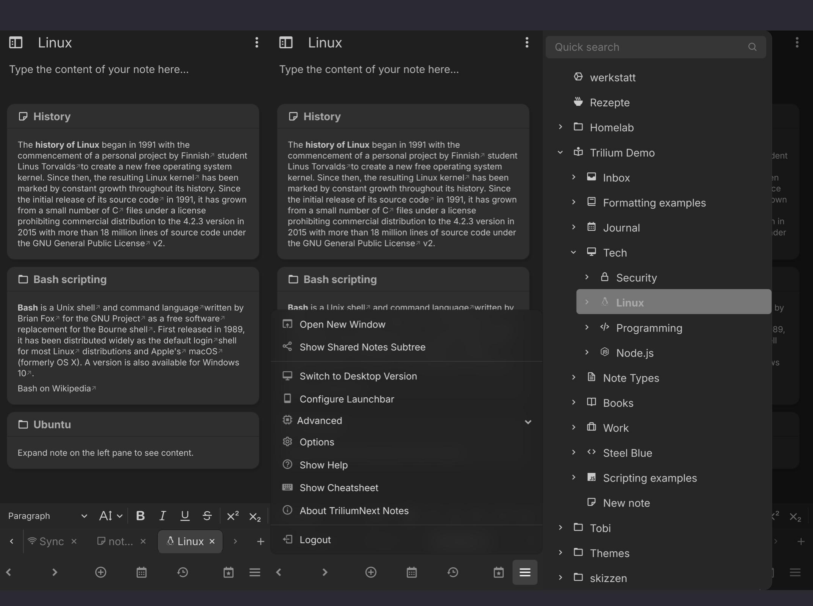
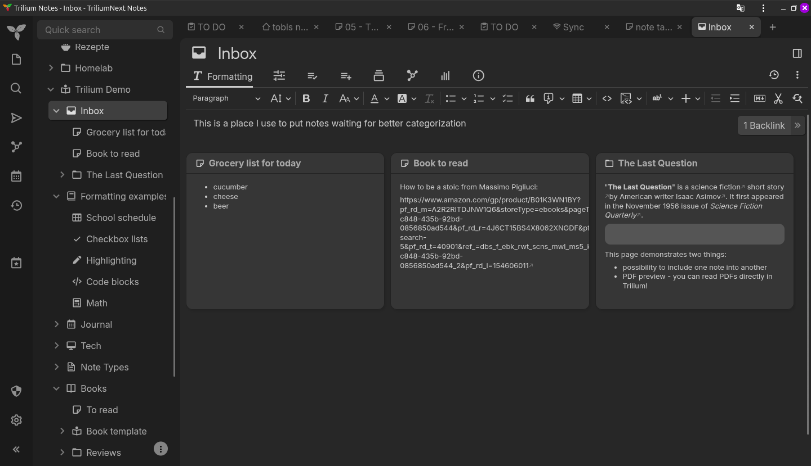

* * *

**Note-Taking-Apps – Mein Weg zur perfekten Open-Source-Lösung**

Notiz-Apps sind eine richtig feine Sache. Ich nutze sie gerne unterwegs auf dem Smartphone, aber auch am Laptop oder Desktop möchte ich mir Ideen notieren oder schnell auf Notizen vom Handy zugreifen können.

Da ich am liebsten – und eigentlich ausschließlich – freie Software verwende, steht bei meiner Suche nach einer geeigneten Notiz-App eine grundlegende Voraussetzung ganz oben:

**Die App muss Open Source sein.**

Zudem sollte sie:

*   zwischen verschiedenen Geräten zuverlässig und verlustfrei synchronisieren,
*   für mobile Displays optimiert sein – idealerweise mit einer eigenständigen App oder zumindest als solide Progressive Web App (PWA).

Diese drei Anforderungen müssen erfüllt sein – dann bin ich zufrieden. Doch bis ich an diesem Punkt angekommen bin, habe ich meine Notizen über die letzten Monate (ehrlich gesagt: Jahre) immer wieder umgezogen und neue Tools ausprobiert.

**Hoffentlich ist damit jetzt Schluss.**

Bevor ich auf meine aktuelle Lösung eingehe, ein kurzer Überblick über meine bisherigen Stationen:

* * *

### **Obsidian.md**

Der Start meiner Reise. Richtig schönes Tool, stark im Handling – egal ob mobil oder am Desktop. Das Design ist top, die UX auch.  
Aber:

*   Der Selfhosted-Sync ist ein ständiges Gefrickel.
*   Und: **nicht Open Source.**

Damit war klar – so schön das Tool ist – nein danke!

* * *

### **Logseq**

Vom Look and Feel her ähnlich wie Obsidian, aber: Open Source.  
Klingt erstmal gut.  
In der Praxis war der Sync aber noch frustrierender als bei Obsidian, wenn man ihn selbst hosten will.  
Und leider wirkt es zunehmend so, als würde sich bei der Weiterentwicklung nicht mehr viel tun. Auf Reddit liest man einiges über interne Probleme – wie viel davon stimmt, kann ich nicht beurteilen, aber Logseq und ich - das wird nichts mehr!

* * *

### **Anytype**

Kurzzeitig genutzt, mit Selfhosted-Sync-Server. Der funktioniert erstaunlich gut, die App sieht klasse aus – mobil und auf dem Desktop.  
Aber:

*   Kein echtes Open Source – nur „Open Code“.
*   Und: **Viel zu überladen** für meine Zwecke.  
    Das ist was für Leute, die Notion bis zur letzten Funktion ausreizen. Mir war’s einfach too much.

* * *

### **AppFlowy (Selfhosted)**

Lange mein daily note-driver.  
Geschrieben in Rust und Flutter, Open Source, super Sync, tolles UI für Mobile und Desktop.  
Aber auch hier wieder: **zu mächtig für meinen Solo-Einsatz.**  
Allein zehn Container laufen dafür in meinem Homelab – für private Notizen einfach OP.  
Zudem liegt der Fokus der Entwicklung mittlerweile stark auf KI-Features. Die brauche ich schlicht nicht.  
Features, die mir fehlten, hatte ich mal bei GitHub eingereicht – aber offenbar liegen die nicht auf der Roadmap.  
Trotzdem: Für Teams ist AppFlowy nach wie vor eine richtig nice Lösung.

* * *

### **Trilium Next**

Und hier bin ich nun endlich gelandet – und bisher voll zufrieden.

*   **Open Source.**
*   Läuft mit wenigen Zeilen Docker im eigenen Container.
*   Der Sync zwischen zwei Geräten ist quasi in Echtzeit – kaum Verzögerung.
*   Trilium Next läuft komplett im Browser.  
    Ich nutze es als **PWA** – auf Android und unter Fedora – und es fühlt sich auf beiden Plattformen wie eine native App an. Besonders die mobil optimierte Version auf dem Phone überzeugt mich richtig.

### Mobile View

### Desktop View

Werde auch noch einen ausführlichen Artikel mit Anleitung zum selbst hosten über TriliumNext schreiben