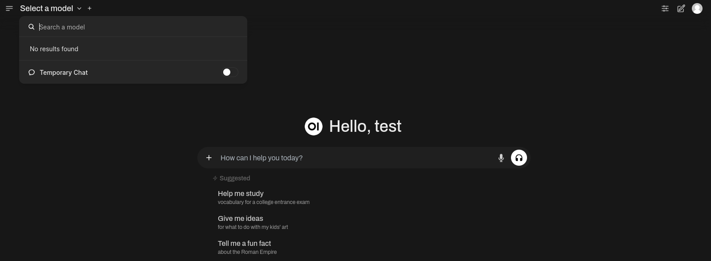
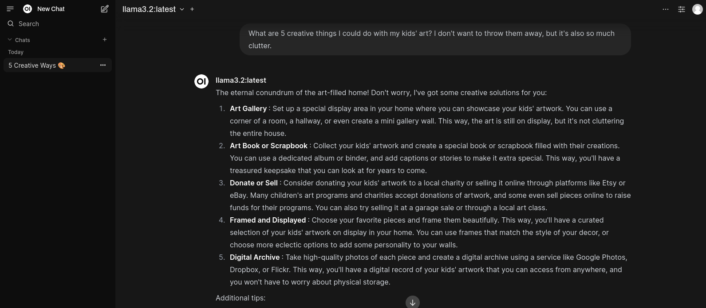

# 1. Intro

Ein Thema hatte ich schon lange auf meiner To-Do-Liste, jetzt bin ich mal dazu gekommen mich darum zu kümmern. 
Es geht um LLM also Large Language Models. 
Hier hat sich das Warten definitiv gelohnt, mittlerweile kann ich mir eine ChatGPT ähnliche Oberfläche aufsetzen und viele verschiedene Open-Source-LLM dort schnell und einfach einbinden.

Damit es schön bequem zu installieren ist, nutze ich hier Docker.
Wenn du noch kein Docker installiert haben solltest, kannst du [hier](/posts/server-setup#5-docker-und-docker-compose) nachlesen wie das geht.

Diese Anwendung lasse ich lokal auf meinem Desktop-PC laufen, weil dieser eine GPU hat und das LLM so deutlich schneller läuft.

Es würde aber auch nur auf der CPU laufen können, es kommt immer auf die Modelle an. Es gibt mittlerweile jedoch ziemlich gut kleine Modelle, die ohne GPU relativ schnell laufen.

Ungeduldigen Menschen ist eine GPU hier definitiv zu empfehlen.

Grundsätzlich lässt sich dieses Setup auch online betreiben und per Traefik ins Internet freizügentlich machen, wenn ihr Interesse daran habt, meldet euch gerne.

---

## 2. Voraussetzungen

Bevor wir starten, stellt sicher, dass folgende Voraussetzungen erfüllt sind:

- [Docker & Docker Compose v2](/posts/server-setup#5-docker-und-docker-compose)

---

## 3. Verzeichnis erstellen

```bash
mkdir /opt/containers/openwebui-ollama
```

---

## 4. `docker-compose.yaml` erstellen

Erstellt eine neue Datei namens `docker-compose.yaml` mit folgendem Inhalt:

```shell
nano docker-compose.yaml
```

```yaml title="docker-compose.yaml"

---
services:
  openwebui:
    image: ghcr.io/open-webui/open-webui:main
    environment:
      - 'OLLAMA_BASE_URL=http://0.0.0.0:11434'
    ports:
      - "3000:8080"
    restart: unless-stopped
    volumes:
      - ./open-webui:/app/backend/data
    extra_hosts:
      - 'host.docker.internal:host-gateway'
  ollama:
    container_name: ollama
    image: ollama/ollama  
    ports:
      - '11434:11434'
    volumes:
      - ./ollama:/root/.ollama
    restart: unless-stopped
    ### <---> Für die NVIDIA GPU
    deploy:
      resources:
        reservations:
          devices:
          - driver: nvidia
            capabilities: ["gpu"]
            count: all
    ### <---> Für die NVIDIA GPU

``` 

Ich nutze hier eine NVIDIA-GPU, falls ihr ohne GPU arbeiten müsst, ihr müsst den letzten Block unten entfernen.

---

## 5. NVIDIA Container Toolkit

Damit Docker auf euere GPU zugreifen kann müssen wir noch das NVIDIA Toolkit installieren. Ich nutze Fedora und dort geht das relativ einfach mit diesen Befehelen

```bash
curl -s -L https://nvidia.github.io/libnvidia-container/stable/rpm/nvidia-container-toolkit.repo | \
  sudo tee /etc/yum.repos.d/nvidia-container-toolkit.repo

sudo yum-config-manager --enable nvidia-container-toolkit-experimental
```

Wenn ihr eine andere Distro oder OS benutzt schaut mal [hier](https://docs.nvidia.com/datacenter/cloud-native/container-toolkit/latest/install-guide.html) vorbei.

---

## 6. Container starten

Nun können wir den Container-Stack starten

```bash
cd /opt/containers/openwebui-ollama && docker compose up -d
```

Das wird je nach Internetverbindung etwas dauern, da die beiden Docker-Container zusammen 8 GB groß sind.

Wenn alles geladen und entpackt ist, können wir mal [localhost:3000](http://localhost:3000) ansurfen.

Dort werdet ihr von einer Login-Maske begrüßt und könnt euch initial einen Admin-Account anlegen.
Danach loggt ihr euch ein; jetzt solltet ihr auf der Open-Web-UI sein.

---

## 7. Modelle hinzufügen

Jetzt sollte es erstmal so bei euch aussehen:



Um LLM hinzuzufügen müssen wir dieses über Ollama installieren. Das geht zum Glück ziemlich einfach. Eine Übersicht aller Modelle findet ihr hier:

[Ollama Modelle](https://ollama.com/search)

Ich nehme zum Start mal das Llama 3.2 von Meta, das sich für Testzwecke ziemlich gut eignet, weil es nur 2 GB groß ist und auch auf einer relativ aktuellen CPU laufen sollte. 

Da Ollama im Container läuft, müssen wir das Modell auch im Container installieren und laufen lassen, das geht so. 

```bash
docker exec ollama ollama run llama3.2
```

Sobald der Prozess abgeschlossen ist, solltet ihr oben das Modell auswählen können und dann geht's los. 



Die Container sind so eingerichtet, dass sie bei jedem Neustart automatisch starten. Wenn du das nicht möchten, musst du die Restart-Policy in der Docker-Compose-Datei ändern, indem man einfach diese Zeilen auskommentiert.

---

**Quellen:**

[Ollama Github](https://github.com/ollama/ollama)

[OpenWebUI Github](https://github.com/open-webui/open-webui)