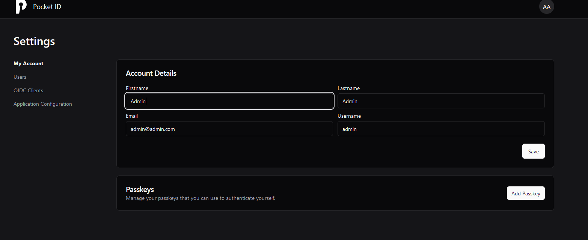

## Intro 

Pocket ID ist ein einfacher OIDC-Anbieter, der es Benutzern ermöglicht, sich mit ihren Passkeys bei Ihren Diensten zu authentifizieren.

Das Ziel von Pocket ID ist es, einfach und benutzerfreundlich zu sein. Es gibt andere selbst gehostete OIDC Anbieter wie Keycloak oder Authentik, aber diese sind oft zu komplex für einfache Anwendungsfälle.

Eine Besonderheit von Pocket ID ist, dass es nur die Passkey-Authentifizierung unterstützt, was bedeutet, dass du kein Passwort benötigen. Zum Beispiel kannst du jetzt einen physischen Yubikey verwenden, um dich einfach und sicher bei all deinen selbst gehosteten Diensten anzumelden.

---

## 2. Voraussetzungen

Bevor wir starten, stellt sicher, dass folgende Voraussetzungen erfüllt sind:

- [Docker & Docker Compose v2](/posts/server-setup#5-docker-und-docker-compose)
- [Traefik Setup](/posts/traefik)

---

## 3. Ordner anlegen

Zuerst legen wir uns passende Ordner-Strukturen an.

```
mkdir -p /opt/containers/pocket-id
```

---

## 4. Compose Datei anlegen

```
nano /opt/containers/pocket-id/compose.yml
```

```yaml title="compose.yml"
services:
  pocket-id:
    image: ghcr.io/pocket-id/pocket-id
    restart: unless-stopped
    env_file: .env
    volumes:
      - "./data:/app/backend/data"
    labels:
      - "traefik.enable=true"
      - "traefik.http.routers.pocket.entrypoints=websecure"
      - "traefik.http.routers.pocket.rule=Host(`pocket.deinedomain.de`)"
      - "traefik.http.routers.pocket.tls=true"
      - "traefik.http.routers.pocket.tls.certresolver=cloudflare"
      - "traefik.http.routers.pocket.service=pocket"
      - "traefik.http.services.pocket.loadbalancer.server.port=80"
      - "traefik.docker.network=frontend"
    networks:
      - frontend
    # Optional healthcheck  
    healthcheck:
      test: "curl -f http://localhost/health"
      interval: 1m30s
      timeout: 5s
      retries: 2
      start_period: 10s
networks:
  frontend:
    external: true
```

**Noch anzupassen:**

* Eure Traefik URL =Host(`pocket.deinedomain.de`)


### 4.1 .ENV Datei anlegen

```
nano /opt/containers/pocket-id/.env
```

```yaml title=".env"

# Bitte die Domain wie oben anpassen
PUBLIC_APP_URL=https://pocket.deinedomain.de
``` 

---

## 5. Pocket ID starten

Nun starten wir den Container mittels folgendem Befehl:

```
docker compose -f /opt/containers/pocket-id/compose.yml up -d
```

Der Container ist in wenigen Sekunden gebaut.

Ruft nun im Browser die gewählte Domain auf und dann solltet ihr folgendes sehen.


Für das erstellen des ersten Benutzers bzw. Passkeys geht ihr bitte auf folgende Seite

https://pocket.deinedomain.de/login/setup

Dort könnt ihr dann den ersten Benutzer anlegen


Folgt den Anweisungen und dann solltet ihr im Admin bereich laden.



Der Erstellung der OIDC Clients ist wirklich einfach, alle nötigen Infos findet ihr hier bei GitHub:

https://github.com/stonith404/pocket-id?tab=readme-ov-file#add-pocket-id-as-an-oidc-provider

---

**Quellen:**

https://pocket-id.org/

https://github.com/stonith404/pocket-id