## Dein eigener Podcatcher? Warum eigentlich nicht.

Du wolltest schon immer mal **deinen eigenen Podcatcher bauen**?  
Nicht abhängig sein von Spotify, Apple Podcasts oder sonstigen Plattformen, sondern deinen Podcatcher **selbst hosten und verwalten**?

Genau das hab ich jetzt mal ausprobiert – und zwar mit **Audiobookshelf**. 

**Spoiler:** Funktioniert richtig gut.

* * *

### Audiobookshelf – nicht nur für Hörbücher

Audiobookshelf ist eigentlich ein self-hosted **Hörbuchserver**, aber:  
Das Ding kann auch Podcasts. Und zwar **genauso wie ein klassischer Podcatcher** – nur eben **auf deinem eigenen Server**.

Du kannst deine Podcasts über **klassische RSS-Feeds abonnieren**, automatisch neue Episoden downloaden lassen und über verschiedene Clients (z. B. [**Plappa**](https://github.com/LeoKlaus/plappa) für iOS oder [**Lissen**](https://github.com/GrakovNe/lissen-android) auf Android) abspielen.

Ich finde das eine ziemlich coole Sache und dieses Setup läuft seit einigen Monaten sehr stabil und ich bin voll happy damit.

* * *

### So baust du dir deinen eigenen Podcatcher

Hier ein ganz kurzer Überblick, wie du loslegen kannst:

1.  **Audiobookshelf installieren**  
    → Läuft easy in Docker. Ein Compose-File reicht.
2.  **Audiobookshelf einrichten**  
    → Zugriff konfigurieren, Medienordner anlegen, Nutzer einrichten.
3.  **Podcast per RSS-Feed hinzufügen**  
    → Einfach den gewünschten Feed einfügen, fertig. Du kannst einstellen, dass neue Folgen automatisch heruntergeladen werden.
4.  **App installieren**  
    → Ich nutze auf iOS **Plapper**, auf Android **Lissen**. Beide unterstützen ABS als Backend und funktionieren wie ganz normale Podcast-Apps – nur eben mit deinem Server im Hintergrund.

* * *

## **Audiobookshelf installieren**

#### Versionierung
Datum | Änderung
--|--
17-06-2025| Initialer Release

---

## Voraussetzungen

Bevor wir starten, stellt sicher, dass folgende Voraussetzungen erfüllt sind:

- [Docker & Docker Compose v2](/posts/server-setup#5-docker-und-docker-compose)
- [Traefik Setup](/posts/traefik)

---

**Zu erst legen wir mal die passende Ordner Struktur an**

```bash
mkdir -p /opt/containers/audiobookshelf && cd /opt/containers/audiobookshelf
```

Erstellen die `compose.yaml`

```bash
nano /opt/containers/audiobookshelf/compose.yaml
```

Und pasten folgenden Inhalt rein

```yaml
 services:
  audiobookshelf:
    image: ghcr.io/advplyr/audiobookshelf:latest
    volumes:
      - /mnt/share/audiobooks:/audiobooks # <- Mountpoint für Hörbucher. Bitte ändern
      - /mnt/share/podcasts:/podcasts # <- Mountpoint für Podcasts. Bitte ändern
      - ./config:/config
      - ./meta:/metadata
    environment:
      - TZ=Europe/Berlin
    restart: always
    labels:
      - "traefik.enable=true"
      - "traefik.http.routers.audiobookshelf.entrypoints=websecure"
      - "traefik.http.routers.audiobookshelf.rule=(Host(`audiobookshelf.deinserver.de`))"
      - "traefik.http.routers.audiobookshelf.tls=true"
      - "traefik.http.routers.audiobookshelf.tls.certresolver=cloudflare"
      - "traefik.http.routers.audiobookshelf.service=audiobookshelf"
      - "traefik.http.services.audiobookshelf.loadbalancer.server.port=80"
      - "traefik.docker.network=frontend"
    networks:
      - frontend
networks:
  frontend:
    external: true
```

Hier müsst ihr einmal in den Traefik-Labels eure Domain anpassen und einen Ort wählen, wo eure Podcasts (und ggf. Hörbücher) liegen sollen.

Bei mir sollen die Daten auf meinem Fileserver landen – den habe ich per NFS auf `/mnt/share` gemountet. Das müsst ihr natürlich an eure Umgebung anpassen.    
Ihr könnt die Dateien aber auch einfach direkt im Verzeichnis ablegen, z. B. mit `- ./podcasts:/podcasts`, ganz wie ihr wollt…  
 

Startet den Server nun mit

```bash
docker compose up -d
```

* * *

## Audiobookshelf einrichten

Dann ruft ihr eure Domain im Browser auf – und solltet erstmal von Audiobookshelf begrüßt werden. Erstellt euch hier einen Account.

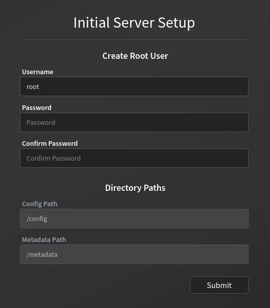

Mit dem eben erstellten User loggt ihr euch nun ein.

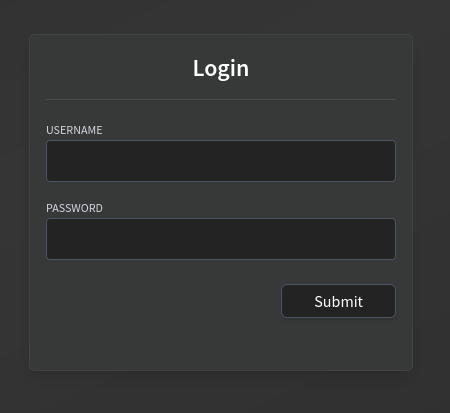

Jetzt können wir unsere erste Bibliothek hinzufügen.

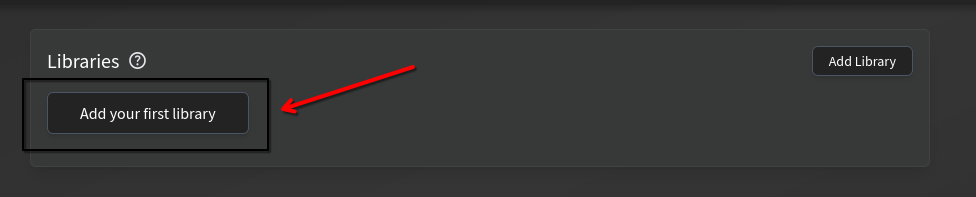

Klickt dafür auf `Browse for Folder`.

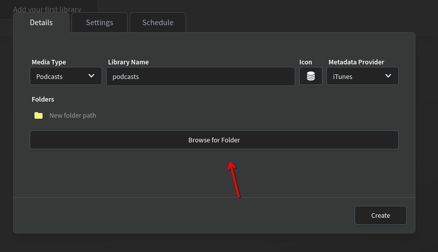

Wählt dann den Ordner `podcasts` aus – das ist der Ordner im Container, den ihr in eurer `docker-compose`-Datei gemountet habt.

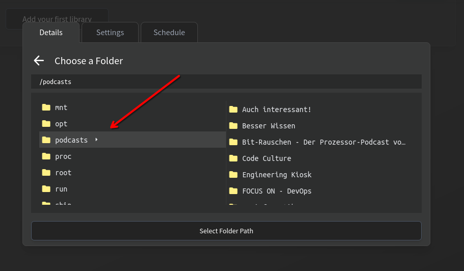

Mit `Create` fügt ihr diesen Ordner in Audiobookshelf ein. Der Inhalt wird gescannt – falls schon Podcasts vorhanden sind, wie bei mir.

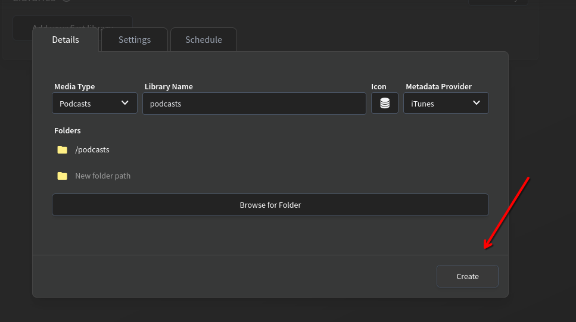

Hier könnt ihr den Scan auch manuell anstoßen.

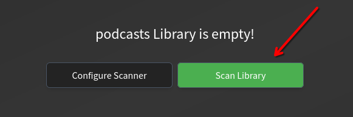

Nun sollten Thumbnails und Audiodateien heruntergeladen sein – und euer Feed sieht dann ungefähr so aus:

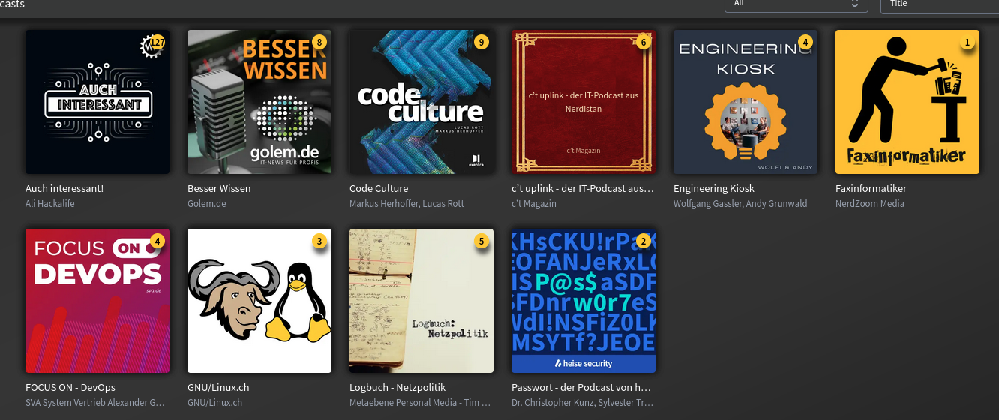

Jetzt könnt ihr einfach den gewünschten Feed hinzufügen – und neue Inhalte werden automatisch geladen.

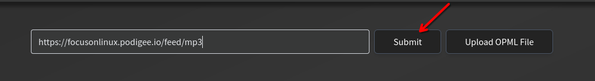

Wenn ihr jetzt auf die Lupe klickt, könnt ihr euch alle verfügbaren Episoden ansehen.

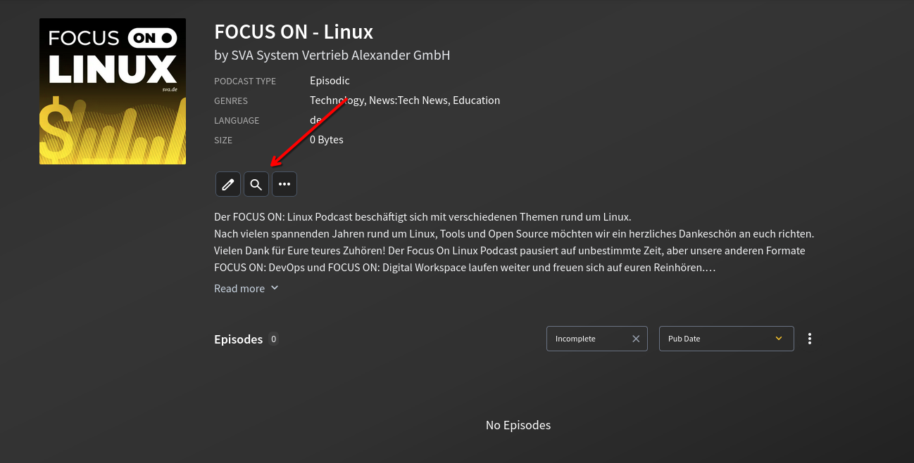

Hier könnt ihr den automatischen Download neuer Folgen aktivieren.

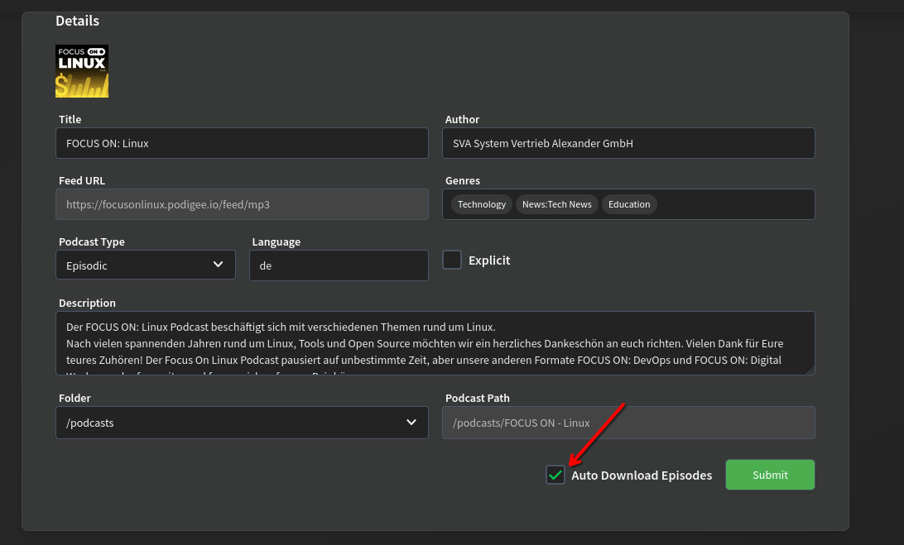

Oder ältere Folgen einfach manuell herunterladen und in euren Podcatcher laden.

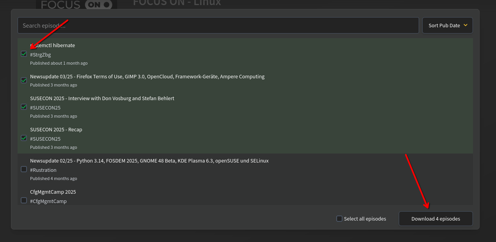

---

Als App fürs Smartphone empfehle ich für Android [Lissen](https://github.com/GrakovNe/lissen-android). Damit bin ich persönlich total zufrieden.

Als iOS-Version würde ich [Plappa](https://github.com/LeoKlaus/plappa) empfehlen – hier wird sogar CarPlay-Integration unterstützt.

Weitere Clients kann man [hier](https://www.audiobookshelf.org/faq/app/#are-there-any-3rd-party-apps) einsehen.

---

## Fazit:

Audiobookshelf ist schnell eingerichtet und sehr intuitiv zu bedienen. Es erledigt die gewünschten Aufgaben – wie den automatischen Download neuer Folgen – zuverlässig und macht damit genau das, was es soll.

Das Web-Frontend ist schön designt, responsive und übersichtlich gestaltet. Dazu gibt es eine ganze Reihe richtig cooler Open-Source-Third-Party-Apps.  
Hier sollte wirklich für jeden Geschmack und Einsatzzweck etwas dabei sein.

---

## Extra 
Audiobookshelf unterstützt OIDC-Login und kann ganz schnell mit Hilfe von [PocketID](/posts/pocket-id) aktiviert werden.  
Wie das geht, liest du am besten direkt in den Docs der [PocketID-Documentation](https://pocket-id.org/docs/client-examples/audiobookshelf).
