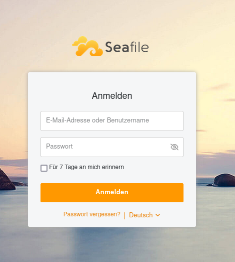

## 1. Intro 

Ich habe mich vor vielen Jahren von den großen Cloud-Speicher-Diensten getrennt. Bei Google oder Dropbox war ich nur im **Free Account** um mir die UI/UX mal zu geben, aber meine Daten habe ich dort nie geparkt.

Dann hatte ich mal einen **pCloud Account** und einen **Proton Drive**, aber richtig Happy war ich damit nicht. Ich habe halt gerne die volle Kontrolle. Früher oder später landet man dann bei **Nextcloud**, auch ich. Aber ich habe mich nur kurz damit rumgeschlagen, weil das "all in one" Konzept mich störte.

Ich wollte einen Dienst, der plattformübergreifend meine Daten synchronisiert ohne andauernd Probleme zu machen.

So bin ich auf **Seafile** gestoßen. Es kann genau das: Daten synchronisieren und das blitzschnell, und es macht einfach nie Probleme. Seit 2018 läuft bei mir ein Seafile.

Erst auf einem Raspberry Pi, mittlerweile in einer **Proxmox-VM** und was soll ich sagen, ich hatte noch nie Probleme.

Hier zeige ich dir, wie du die Version 12 Community Edition mit Docker und Traefik installieren kannst.


### 1.2 Was ist Seafile? 
Seafile ist eine Open-Source-Lösung für Dateisynchronisation und Cloud-Storage, die es ermöglicht, Dateien auf einem eigenen Server zu speichern und auf verschiedenen Geräten abzurufen. Für mich ist es ein 1:1 Ersatz zu Dropbox oder Google Drive. 

* **Dateisynchronisation zwischen Computern und Mobilgeräten:**  Mit Seafile können wir unsere Daten zwischen Computern und Mobilgeräten synchronisieren, ohne dass wir uns auf die kommerziellen Cloud-Anbietern angewiesen sind. Es gibt sowohl für Mac, Windows, Linux, Android und iOS Apps.

* **Cloud-Storage für das Speichern von Dateien in der eigenen Umgebung:**  Wir können unsere eigenen Server verwenden, um unsere Daten zu speichern, anstatt auf kommerzielle Cloud-Anbieter zu setzen. So bleiben unsere Daten unter unserer Kontrolle.

* **Sicherheit durch Verschlüsselung von Dateien:**  Mit Seafile können wir Daten sowohl Verschlüsselt ablegen, aber auch ganz einfach einen Ordner für Freunde und Familie freigeben um gemeinsam Zugriff auf bestimmte Daten zu haben.

---

## 2. Voraussetzungen

Bevor wir starten, stellt sicher, dass folgende Voraussetzungen erfüllt sind:

- [Docker & Docker Compose v2](/posts/server-setup#5-docker-und-docker-compose)
- [Traefik Setup](/posts/traefik)

---

## 3. Projektverzeichnis erstellen

Beginnen wir damit, ein Projektverzeichnis zu erstellen, in dem alle Konfigurationsdateien liegen:

```bash
mkdir /opt/containers/seafile
cd /opt/containers/seafile
```

---

## 4. Projektdateien erstellen

Erstellt eine neue Datei namens `docker-compose.yaml` mit folgendem Inhalt:

```shell
nano docker-compose.yaml
```

```yaml title="docker-compose.yaml"
services:
  db:
    image: ${SEAFILE_DB_IMAGE:-mariadb:10.11}
    container_name: seafile-mysql
    environment:
      - MYSQL_ROOT_PASSWORD=${INIT_SEAFILE_MYSQL_ROOT_PASSWORD:?Variable is not set or empty}
      - MYSQL_LOG_CONSOLE=true
      - MARIADB_AUTO_UPGRADE=1
    volumes:
      - "${SEAFILE_MYSQL_VOLUME:-/opt/containers/seafile/seafile-mysql/db}:/var/lib/mysql"
    networks:
      - seafile-net
    healthcheck:
      test:
        [
          "CMD",
          "/usr/local/bin/healthcheck.sh",
          "--connect",
          "--mariadbupgrade",
          "--innodb_initialized",
        ]
      interval: 20s
      start_period: 30s
      timeout: 5s
      retries: 10

  memcached:
    image: ${SEAFILE_MEMCACHED_IMAGE:-memcached:1.6.29}
    container_name: seafile-memcached
    entrypoint: memcached -m 256
    networks:
      - seafile-net

  seafile:
    image: ${SEAFILE_IMAGE:-seafileltd/seafile-mc:12.0-latest}
    container_name: seafile
    # ports:
    #   - "80:80"
    volumes:
      - ${SEAFILE_VOLUME:-/opt/containers/seafile/seafile-data}:/shared
    environment:
      - DB_HOST=${SEAFILE_MYSQL_DB_HOST:-db}
      - DB_PORT=${SEAFILE_MYSQL_DB_PORT:-3306}
      - DB_USER=${SEAFILE_MYSQL_DB_USER:-seafile}
      - DB_ROOT_PASSWD=${INIT_SEAFILE_MYSQL_ROOT_PASSWORD:-}
      - DB_PASSWORD=${SEAFILE_MYSQL_DB_PASSWORD:?Variable is not set or empty}
      - SEAFILE_MYSQL_DB_CCNET_DB_NAME=${SEAFILE_MYSQL_DB_CCNET_DB_NAME:-ccnet_db}
      - SEAFILE_MYSQL_DB_SEAFILE_DB_NAME=${SEAFILE_MYSQL_DB_SEAFILE_DB_NAME:-seafile_db}
      - SEAFILE_MYSQL_DB_SEAHUB_DB_NAME=${SEAFILE_MYSQL_DB_SEAHUB_DB_NAME:-seahub_db}
      - TIME_ZONE=${TIME_ZONE:-Etc/UTC}
      - INIT_SEAFILE_ADMIN_EMAIL=${INIT_SEAFILE_ADMIN_EMAIL:-me@example.com}
      - INIT_SEAFILE_ADMIN_PASSWORD=${INIT_SEAFILE_ADMIN_PASSWORD:-asecret}
      - SEAFILE_SERVER_HOSTNAME=${SEAFILE_SERVER_HOSTNAME:?Variable is not set or empty}
      - SEAFILE_SERVER_PROTOCOL=${SEAFILE_SERVER_PROTOCOL:-http}
      - SITE_ROOT=${SITE_ROOT:-/}
      - NON_ROOT=${NON_ROOT:-false}
      - JWT_PRIVATE_KEY=${JWT_PRIVATE_KEY:?Variable is not set or empty}
      - SEAFILE_LOG_TO_STDOUT=${SEAFILE_LOG_TO_STDOUT:-false}
      - ENABLE_SEADOC=${ENABLE_SEADOC:-false}
      - SEADOC_SERVER_URL=${SEADOC_SERVER_URL:-http://example.example.com/sdoc-server}
    labels:
      - "traefik.enable=true"
      - "traefik.http.routers.seafile.entrypoints=websecure"
      - "traefik.http.routers.seafile.rule=(Host(`seafile.domain.de`))"
      - "traefik.http.routers.seafile.tls=true"
      - "traefik.http.routers.seafile.tls.certresolver=cloudflare"
      - "traefik.http.routers.seafile.service=seafile"
      - "traefik.http.services.seafile.loadbalancer.server.port=80"
      - "traefik.docker.network=frontend"
    depends_on:
      - db
      - memcached
    networks:
      - seafile-net
      - frontend

networks:
  frontend:
    external: true
  seafile-net:
    name: seafile-net
```

Du musst `- "traefik.http.routers.seafile.rule=(Host(seafile.domain.de))"` noch entsprechend anpassen

Erstellt eine neue Datei namens `.env` mit folgendem Inhalt:

```shell
nano .env
```

```js
COMPOSE_FILE='seafile-server.yml'
COMPOSE_PATH_SEPARATOR=','


SEAFILE_IMAGE=seafileltd/seafile-mc:12.0-latest
SEAFILE_DB_IMAGE=mariadb:10.11
SEAFILE_MEMCACHED_IMAGE=memcached:1.6.29

SEAFILE_VOLUME=/opt/containers/seafile/seafile-data
SEAFILE_MYSQL_VOLUME=/opt/containers/seafile/seafile-mysql/db


SEAFILE_MYSQL_DB_HOST=db
INIT_SEAFILE_MYSQL_ROOT_PASSWORD=s1cheresPassw0rt #<---> BITTE ANPASSEN
SEAFILE_MYSQL_DB_USER=seafile
SEAFILE_MYSQL_DB_PASSWORD=s1cheresPassw0rt123 #<---> BITTE ANPASSEN

TIME_ZONE=Etc/UTC

JWT_PRIVATE_KEY=6KV2OixbOhpn0y6xekMY9baYyUY40ZQ5taffnQx5 s1cheresPassw0rt #<---> BITTE ANPASSEN (pwgen -s 40 1)

SEAFILE_SERVER_HOSTNAME=seafile.dein.server.de #<---> BITTE ANPASSEN (gleiche Domain wie in der docker-compose!!!)
SEAFILE_SERVER_PROTOCOL=https

INIT_SEAFILE_ADMIN_EMAIL=me@example.com #<---> BITTE ANPASSEN
INIT_SEAFILE_ADMIN_PASSWORD=asecret #<---> BITTE ANPASSEN


SEADOC_IMAGE=seafileltd/sdoc-server:1.0-latest
SEADOC_VOLUME=/opt/containers/seafile/seadoc-data

ENABLE_SEADOC=false
SEADOC_SERVER_URL=http://seafile.example.com/sdoc-server


NOTIFICATION_SERVER_IMAGE=seafileltd/notification-server:12.0-latest
NOTIFICATION_SERVER_VOLUME=/opt/containers/seafile/notification-data
```

Bitte passe die Variablen entsprechend an.

---

## 5. Container starten

```bash
cd /opt/containers/seafile && docker compose up -d
```
Der Container sollte so innerhalb von ca. 1-2 Minuten fertig gebaut sein und danach könnt ihr eure Domain aufrufen und hier begrüßt euch nun dem Login-Bildschirm von Seafile.



Hier können Sie sich mit Ihren gewählten Anmeldedaten einloggen.

Falls das nicht geht, kann man über die Konsole auch einen neuen Admin erstellen.

```shell
docker exec -it seafile /opt/seafile/seafile-server-latest/reset-admin.sh
```

Falls der Container nicht startet, helfen Ihnen die Logs weiter.

```shell
docker compose logs --follow
```

---

## 6. App installieren

Du kannst nun bequem die App auf deinem Smartphone installieren und den Drive-Client für dein Betriebssystem installieren.

<div style={{ display: 'flex', justifyContent: 'left', gap: '10px' }}>
  <a href="https://play.google.com/store/apps/details?id=com.seafile.seadroid2">
    
  </a>
  <a href="https://f-droid.org/packages/com.seafile.seadroid2/">
    
  </a>
  <a href="https://apps.apple.com/cn/app/seafile-pro/id639202512?l=en">
    
  </a>
  <a href="https://github.com/haiwen/seadroid/releases/tag/v3.0.7">
    
  </a>
    <a href="https://github.com/haiwen/seadroid/releases/tag/v3.0.7">
    
  </a>
</div>

**Quellen:**

[Seafile Admin Manual](https://manual.seafile.com/12.0/setup/setup_ce_by_docker/)