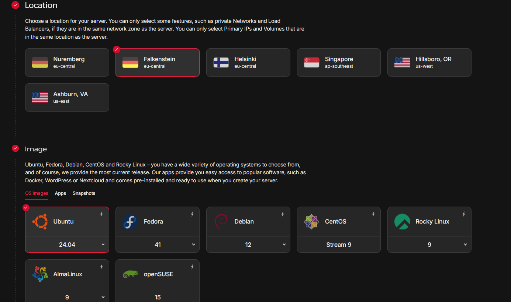
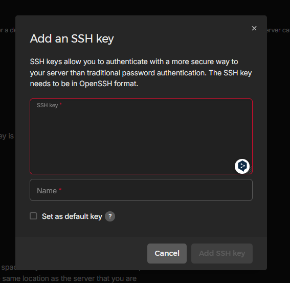
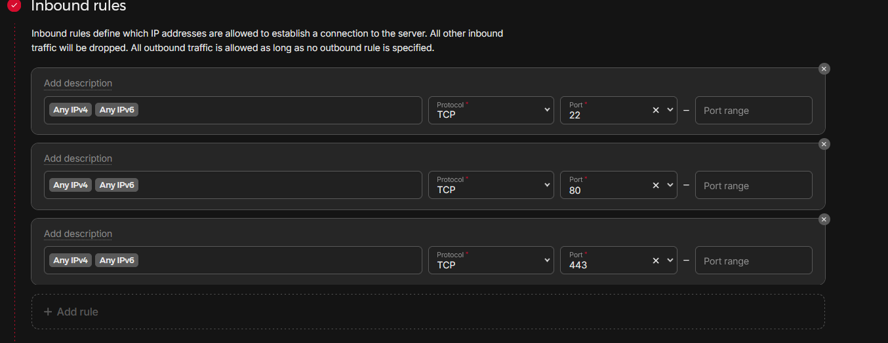

# 1. Intro

Wäre es nicht ziemlich cool, praktische Dienste wie Google Photos, Dropbox oder einen VPN selbst zu hosten?
Möchtest du die volle Kontrolle über deine Daten behalten?

Ich habe vor einigen Jahren den großen Cloud-Anbietern den Rücken gekehrt und kümmere mich seitdem selbst um die Bereitstellung solcher Dienste. Es geht mir dabei vor allem um Datenhoheit – meine Daten sind meine Daten, und ich möchte keine Dienste mit meinen Informationen „bezahlen“.

Google und Co. bieten zwar kostenlose Services an, aber diese sind nicht wirklich umsonst – du zahlst mit deinen (Meta-)Daten. Auf diese Art der „Bezahlung“ möchte ich verzichten. Stattdessen nehme ich die Bereitstellung der notwendigen Infrastruktur selbst in die Hand.

Es gibt viele Open-Source-Projekte, die kommerzielle Dienste nicht nur 1:1 ersetzen, sondern oft sogar übertreffen können. In diesem Artikel möchte ich euch eine Grundlage bieten, um mit Selfhosting zu starten.

---

# 2. Die Hardware

Um mit Selfhosting zu beginnen, braucht man nicht viel. Der Einstieg erfordert zunächst einen PC oder Laptop. Notfalls könnte man sogar ein Tablet oder Smartphone nutzen, aber diese Optionen klammere ich hier aus.

Dieser PC oder Laptop wird später zur Steuerzentrale für deinen Server, denn der Server selbst wird headless betrieben.

**Was bedeutet headless?**

> Ein headless Server läuft ohne angeschlossenen Bildschirm, Maus oder Tastatur. Er wird in der Regel per Fernzugriff über ein Netzwerk gesteuert.


Ob dein Betriebssystem Linux, macOS oder Windows ist, spielt am Anfang keine große Rolle. Persönlich empfehle ich dir aber, Linux als Hauptbetriebssystem zu nutzen – es ist zuverlässig, flexibel und perfekt für Selfhosting.
Server zu Hause oder in der Cloud?

Jetzt stellt sich die Frage: Möchtest du deinen Server zu Hause oder in der Cloud betreiben?


**Zu Hause:**


Hier bietet sich ein Raspberry Pi oder ein kleiner Mini-PC an. Besonders Mini-PCs sind eine günstige Lösung. Viele Unternehmen verkaufen Leasing-Rückläufer als refurbished Geräte, die sich hervorragend für den Einstieg eignen.


**In der Cloud:**


Falls du keinen Platz zu Hause hast oder dich nicht selbst um die Hardware kümmern möchtest, kannst du für etwa 5 € im Monat einen kleinen Server in der Cloud mieten.

Ich persönlich habe gute Erfahrungen mit Hetzner und Netcup gemacht – das ist keine Werbung, sondern nur meine Empfehlung basierend auf eigener Nutzung.

---

# 3. Software

Wenn die Hardwarefrage geklärt ist, geht es weiter mit der Software.

Hier mache ich es kurz: 

Ich nutze seit Jahren den Ubuntu Server und bin damit äußerst zufrieden. Daher empfehle ich euch, damit ebenfalls zu starten.

[Ubuntu Server iso](https://ubuntu.com/download/server)

---

# 4. Server Setup

Für den Anfang erkläre ich die Cloud-Variante mit Hetzner, da sie einfacher und mit weniger Aufwand verbunden ist. Ein separater Artikel über das Einrichten eines Servers zu Hause im Homelab folgt später.

Die Cloud-Option eignet sich ideal zum Testen: Du kannst einen Server aufsetzen, verschiedene Dienste ausprobieren und ihn bei Bedarf einfach wieder kündigen. So besteht kein finanzielles Risiko – der Einstieg kostet lediglich etwa 5 € pro Monat.

---

## 4.1 Server aufsetzen

Account erstellen:
Registriere dich bei Hetzner und logge dich unter [Hetzner](https://www.hetzner.com/cloud/) ein.

**Cloud-Server anlegen:**

* Wähle eine Location (Rechenzentrum).
* Entscheide dich für ein Betriebssystem (ich empfehle hier Ubuntu).
* Wähle den kleinsten Server:
* 2 vCPUs
* 4 GB RAM




Das reicht vollkommen aus, um loszulegen.

---

## 4.2 SSH-Key erstellen:

Um sicher auf deinen Server zugreifen zu können, benötigst du einen SSH-Schlüssel. Falls du noch keinen hast, kannst du ihn wie folgt erstellen:


**SSH-Key erstellen (Windows und Linux)**

Öffne ein Terminal (bei Windows: PowerShell oder das Windows-Subsystem für Linux, WSL).
Führe den folgenden Befehl aus
```shell
ssh-keygen -t ed2551
```

Folge den Anweisungen, um den Schlüssel zu generieren. 

Der öffentliche Schlüssel wird in der Datei `~/.ssh/id_ed25519.pub` (Linux/Mac) oder im entsprechenden Verzeichnis (Windows) gespeichert.

Öffne die Datei id_ed25519.pub in einem Texteditor und kopiere den Inhalt. Füge den Schlüssel dann im Hetzner-Dashboard beim Anlegen des Servers ein.



Bestätige die Einrichtung, und dein Server wird erstellt. Du kannst ihn jederzeit kündigen, falls du ihn nicht mehr benötigst.

---

## 4.3 Firewall-Regeln erstellen

Im Hetzner-Dashboard angekommen:

Wähle deinen Server aus.

Richte eine Firewall ein:
Öffne die Ports 22, 80 und 443 (jeweils für TCP).



Erklärung der Ports:
* Port 22: Für den SSH-Zugriff auf den Server.
* Port 80 und 443: Für HTTP und HTTPS, damit dein Server später Webseiten ausliefern kann.

Nach diesen Schritten ist dein Server sicher und bereit für die nächsten Konfigurationen.

---

# 5. Docker und Docker Compose

Du brauchst eine funktionierende Installation von Docker und Docker Compose. 
Keine Sorge, die Installation ist einfach. 

Hier ist der One-Line-Befehl, um Docker auf deinem Server zu installieren:

```shell
curl -fsSL https://get.docker.com -o get-docker.sh
sudo sh ./get-docker.sh
```

Falls du einen Fehler erhälst, könnte es sein, das curl fehlt, dann instalieren wir es so.

```shell
apt install curl
```

## 5.1 Docker testen

Lass uns mal testen ob Docker ordentlich installiert wurde

```shell
docker run hello-world
```

Der Befehl sollte so oder so ähnlich dann in der Konsole aussehen.

```shell
test@ubuntu-server:~# docker run hello-world
Unable to find image 'hello-world:latest' locally
latest: Pulling from library/hello-world
c1ec31eb5944: Pull complete
Digest: sha256:5b3cc85e16e3058003c13b7821318369dad01dac3dbb877aac3c28182255c724
Status: Downloaded newer image for hello-world:latest

Hello from Docker!
This message shows that your installation appears to be working correctly.
```

---

# 6. DNS Setup

Unser Ziel ist es, mittels Docker Compose mit wenig Aufwand Webservices oder Apps bereitzustellen, z. B. unter cloud.2tap2.be oder immich.2tap2.be. Damit die Anfragen korrekt vom Server beantwortet werden und die Domains richtig auflösen, benötigen wir einen Reverse Proxy. Hierfür nutzen wir Traefik, den wir später installieren werden.

Jetzt ist es zunächst wichtig, die DNS-Einträge richtig zu setzen.
Du könntest z. B. bei Cloudflare unter den DNS-Einstellungen folgende Einträge erstellen:

* Einen Eintrag für cloud, der auf die IP deines Servers zeigt.
* Einen zweiten Eintrag für immich, der ebenfalls auf deine Server-IP verweist.

Damit kann Traefik die Anfragen verarbeiten und korrekt weiterleiten.

Falls du keine Lust hast, für jede Subdomain einen neuen DNS-Eintrag zu erstellen, kannst du auch einen Wildcard-Eintrag setzen, z. B. *.homelab, der auf deine Server-IP zeigt. Dadurch kannst du beliebige Subdomains verwenden, wie etwa yopass.homelab.2tap2.be.

---

## 7. Nützliche Tools

Eine gute Entwicklungsumgebung erleichtert die Arbeit enorm. 
Ich empfehle dir eine IDE wie Visual Studio Code oder dessen Open-Source-Variante VSCodium.

[VSCodium](https://vscodium.com/)

[VSCode](https://code.visualstudio.com/)

Beide sind einfach zu bedienen und unterstützen zahlreiche nützliche Plugins, die dir die Arbeit erleichtern. Es lohnt sich definitiv, mal 30 Minuten auf YouTube zu investieren, um sich das grundlegende Konzept anzuschauen.

