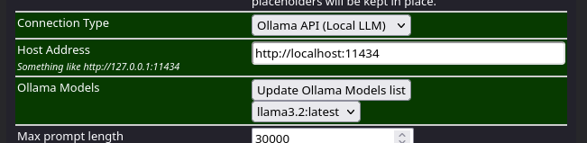
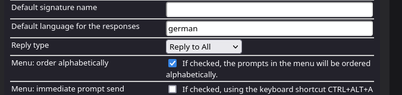
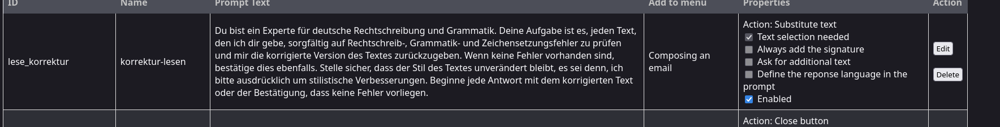
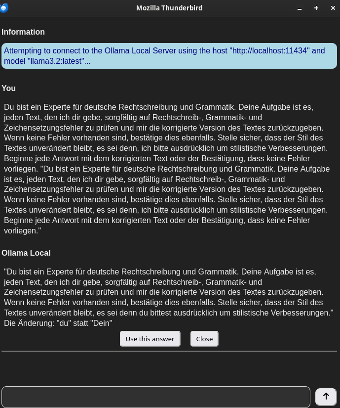

## 1. Intro

Ich finde es sehr praktisch, E-Mails auf korrekte Rechtschreibung überprüfen zu lassen, ohne dabei meinen Fokus zu verlieren.

Normalerweise läuft es so: 

Ich schreibe einfach drauf los, und kleine Rechtschreibfehler stören mich nicht, da ich am Ende sowieso alles mit `Ctrl+C` kopiere, in **ChatGPT** einfüge, dort Korrektur lesen lasse und anschließend mit `Ctrl+V` wieder in **Thunderbird** einfüge.

Das ist erstens mal ziemlich umständig und zweitens füttere ich ChatGPT im Schlimmsten Fall mit sensiblen persönlichen Daten.

Wenn du eine integrierte KI-Korrektur-Lesung in Thunderbird haben möchtest und Wert auf deine persönlichen Daten legst, ist **ThunderAI** in Kombination mit **Ollama** genau das, was du brauchst.

Ich zeige dir, wie du es in Thunderbird einbindest und wie du damit deine E-Mails KI gestützt korrigieren lassen kannst.

---

## 2. Ollama installieren

Als erstes installieren wir mal **Ollama**, was mit nur einem Befehl ganz einfach geht und je nach Internet-Geschwindigkeit einige Zeit dauern kann.

```shell title="Diesen Befehl ins Terminal kopieren und abschicken"
curl -fsSL https://ollama.com/install.sh | sh
```

Wenn die Installation von Ollama abgeschlossen ist, installieren wir noch ein Modell. Hier in diesem Fall nehmen wir das Llama 3.2 , das sich für die Aufgabe ziemlich gut eignet. 

Wir installieren das Modell mit folgendem Befehl: 

```shell title="Install llama3.2:3b"
ollama run llama3.2
```

Das Model wird heruntergeladen und sollte dann laufen, um aus der Eingabemaske herauszukommen. Schreibe dazu einfach:

```shell
/bye 
```

---

### 2.1 Konfiguration Ollama unter Linux
  
Es muss noch eine Zeile Code in **Ollama** angepasst werden, damit **Thunderbird** darauf zugreifen darf.

```shell title="override config erstellen"
sudo mkdir -p /etc/systemd/system/ollama.service.d/ && nano /etc/systemd/system/ollama.service.d/override.conf
```

Fügt dort folgenden Inhalt ein:

```bash title="override.conf"
[Service]
Environment="OLLAMA_ORIGINS=moz-extension://*"
```
Dann:

```shell title="systemctl reload"
sudo systemctl daemon-reload
```
Und:

```shell title="ollama restart"
sudo systemctl restart ollama.service
```

Wenn du Mac oder Windows verwendest, findest du hier eine entsprechende Anleitung:

[ollama-cors-information](https://micz.it/thunderbird-addon-thunderai/ollama-cors-information/)

---

## 3. ThunderAI installieren

Das du bereits **Thunderbird** installiert hast, setze ich mal vorraus.

Also machen wir uns daran, das Plugin zu installieren.

Im Menü `Add-ons und Themes` -> `Extensions` -> Suche nach **ThunderAI**

[Hier der Link zum Plugin](https://addons.thunderbird.net/en-US/thunderbird/addon/thunderai/?src=search)

Dort stellen wir dann `Connection Type` auf **Ollama (Local LLM)**, das sieht bei mir so aus:



Und unter `default language` stellen ich die Sprache auf Deutsch.



---

### 3.1 Custom Prompts

Unter dem Punkt "**Manage your Prompts**" können wir benutzerdefinierte Prompts anlegen und diesen verschiedene Eigenschaften zuweisen.

Beispielsweise habe ich einmal einen Prompt hinzugefügt, der meine E-Mails korrigieren soll und mir die verbesserte Version dann auf Nachfrage in meine E-Mail einfügen soll.

Das sieht dann so aus:



```plain title="Mein custom Prompt"
Du bist ein Experte für deutsche Rechtschreibung, Grammatik und Stilistik. Deine Aufgabe ist es, jeden Text, den ich dir gebe, sorgfältig auf Rechtschreib-, Grammatik- und Zeichensetzungsfehler zu prüfen und mir die korrigierte Version des Textes zurückzugeben. Wenn keine Fehler vorhanden sind, bestätige dies ebenfalls. Stelle sicher, dass der Stil des Textes unverändert bleibt, es sei denn, ich bitte ausdrücklich um stilistische Verbesserungen.
```

Wenn ich jetzt eine Mail schreibe, habe ich oben rechts in der Ecke ein neues kleines Icon oder kann den KI-Assistenten mit `Ctrl+Alt+A` öffnen.



So kann ich meine Mails in **Thunderbird**  korrigieren lassen. Das ist echt der Hammer!!! 

---

**Quellen:**

[MICZ](https://micz.it/thunderbird-addon-thunderai/)

[Ollama](https://ollama.com/)