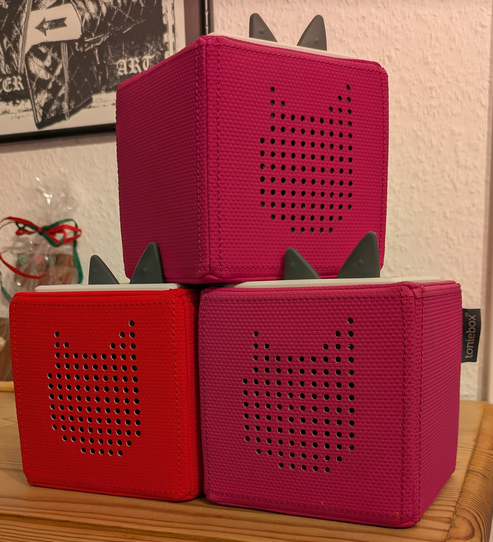
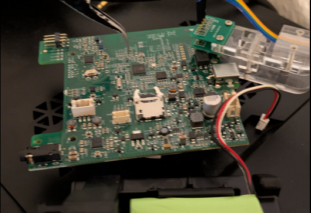
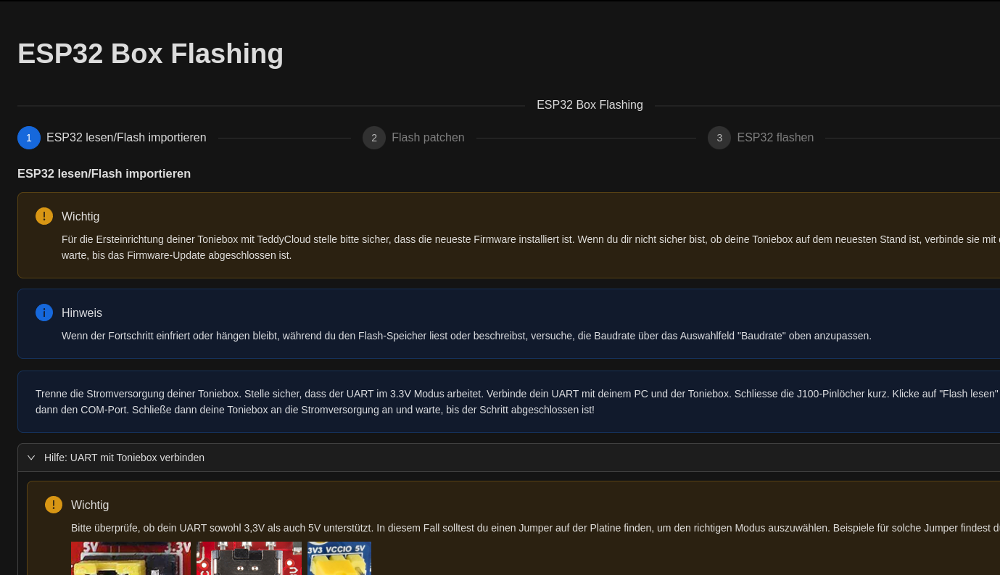

## 1. Intro 

Die Tomaten aus dem eigenen **Garten** schmecken immer besser als die aus dem Supermarkt. Das ist einfach so.

Seine Fotos mit der eigenen **Cloud** zu synchronisieren fühlt sich auch besser an, als wenn Google das für mich macht. Das ist auch einfach so.

**Selfhosting** kann man also mit dem **Gärtnern** vergleichen. Ich habe die Dinge selbst in der Hand und wenn etwas nicht läuft, kümmere ich mich selber darum.

Ich lasse mich zu Hause einfach nicht gerne von anderen Firmen überwachen. Ich möchte meine Daten selbst kontrollieren.

Auf meinem PC läuft **Fedora**, auf meinem Smartphone **GrapheneOS** und unsere **Tonie-Box?**

<u>**Was macht sie eigentlich den ganzen Tag?**</u>

Ja, sie funkt schön fleißig alles in die Firmen-Cloud, was mein Kind so damit macht. Jede Bewegung der Box, jeder Figur wechseln, die Veränderung der Lautstärke, alles wird überwacht. 

**Das ist nicht wirklich cool.**

Das war mir bis vor kurzem nicht bewusst, bis ich einen Talk vom [37C3](https://media.ccc.de/v/37c3-11993-toniebox_reverse_engineering) gehört habe, der genau darüber ging. Hier hat das **Team Revvox** auch direkt eine Lösung parat gestellt.

Die **Teddycloud** ist eine eigene Verwaltungssoftware für meine Tonies, ohne nerviges Datenabfluss an dritte. Die Software bringt zusätzlich einige coole Funktionen mit. Ich kann mir nun selber Toniefiguren basteln und mit Inhalt bestücken, oder auch Radio darüber hören.

Jetzt hat unser Kind einen Radio-Tonie, der die "Sendung mit der Maus"-Radio-Sendung startet.

import Callout from '@/components/Callout.astro'

<Callout icon="⚠️" type="warning">
Ich habe die neuste Version der Toniebox benutzt mit einem **ESP32 Controller von Espressif**. Es geht auch mit den Controllern von Texas Instruments, aber damit habe ich mich "noch" nicht beschäftig. 
</Callout>

Relativ einfach geht es mit der MAC-Adresse, diese steht auf der Rückseite der Box, tragt diese [hier](https://macvendors.com/) ein dann wisst ihr welcher Controller verbaut ist.


---

## 2. Grundvoraussetzung

- [Toniebox](https://tonies.com/de-de/)
- [Docker & Docker Compose v2](/posts/server-setup#5-docker-und-docker-compose)
- [UART Adapter](https://www.amazon.de/gp/product/B01N9RZK6I/) -> Soll keine Werbung sein
- [PCB Klemme](https://www.amazon.de/gp/product/B0BV79V2DW/) -> Soll keine Werbung sein
- [Lokaler Server](https://www.amazon.de/s?k=raspberry+pi) -> Irgendein Server, Raspberry Pi zB.
- [YouTube Video](https://www.youtube.com/watch?v=JpMRyshgy9o) -> Vorher anschauen
---

## 3. Teddycloud installieren

Wir brauchen einen Raspberry Pi oder anderen MiniPC der lokal in unserem Netzwerk läuft. Es geht natürlich auch ein LXC in Proxmox oä. Hier muss [Docker & Docker Compose v2](/blog/server-setup#5-docker-und-docker-compose) drauf installiert sein.
Und das Gerät sollte 24/7 laufen können.

Wir erstellen die Ordnerstruktur:

```shell
mkdir /opt/containers/tedddycloud && cd /opt/containers/teddycloud
```

Wir erstellen die Docker Compose Datei

```shell
nano compose.yaml
```

Und kopieren folgeden Inhalt rein:

```yaml title="compose.yaml"
services:
  teddycloud:
    container_name: teddycloud
    hostname: teddycloud
    image: ghcr.io/toniebox-reverse-engineering/teddycloud:latest
    ports:
     - 80:80 #optional (for the webinterface)
     - 8443:8443 #optional (for the webinterface)
     - 443:443 #Port is needed for the connection for the box, must not be changed!
    volumes:
      - certs:/teddycloud/certs #certificates of the server
      - config:/teddycloud/config #config file for the server and the boxes
      - content:/teddycloud/data/content #microSD representation for the boxes
      - library:/teddycloud/data/library #library to manage content
      - custom_img:/teddycloud/data/www/custom_img #location to store custom images for custom tonies json
      - firmware:/teddycloud/data/firmware #firmware backups
      - cache:/teddycloud/data/cache #img cache for content images
    restart: unless-stopped
volumes:
  certs:
  config:
  content:
  library:
  custom_img:
  firmware:
  cache:
```

Wenn noch keine Anwendungen auf deinem System laufen kannst du das nächste Kommando überspringen. 

Wenn schon Anwendungen bei dir laufen sollen, solltest du schauen, ob deine Ports 80 und 443 noch frei sind." 

```shell
sudo netstat -tulpn | grep 80
```

```shell title="mögliche ausgabe"
tcp        0      0 0.0.0.0:80              0.0.0.0:*               LISTEN      1834218/docker-prox 
``` 

Wenn die Ports belegt sind musst du diese in der `compose.yaml` Datei abändern.


Startet nun Teddycloud mit diesem Befehl:

```shell
docker compose up -d
```

Der initiale Start kann je nach Hardware mehrere Minuten dauern, ihr könnt mit diesem Befehl in die Logs schauen:

```shell
docker compose logs -f
```

mit `CTRL + C` könnt ihr die Logs wieder schließen.

---

## 4. Teddycloud aufrufen

Jetzt könnt ihr die IP-Adresse eures Servers oder Raspi ansurfen und wählt den Port Nummer 8443, also z.B. `192.168.178.100:84433`.

Um die Box bequem im Browser zu flashen, verwende bitte einen unterstützenden Webbrowser wie Chrome oder Edge, da diese Browser die Web Serial API unterstützen. 

Warum Firefox das nicht kann, wäre mal interessant.



---

## 5. Toniebox flashen

Ab hier kannst du dich am besten an die Anleitung im Browser halten, hier ist alles Schritt für Schritt mit Bildern erklärt.

Außerdem ist das [YouTube Video](https://www.youtube.com/watch?v=JpMRyshgy9o) auch eine sehr gute Quelle, um den Flash-Vorgang sich vorher einmal genau anzuschauen.



---

## 6. Nach dem flashen

Jetzt hast du die Teddycloud Custom Firmware erfolgreich auf deiner Toniebox geflasht. Ab jetzt kannst du sie wie gewohnt benutzen, zusätzlich hast du folgende Möglichkeiten: 

* Du sendest keine Nutzerdaten mehr an die Firma Tonies.
* Du kannst nun auch eigene Inhalte auf alle (auch originale) Tonie-Figuren schreiben.
* Du kannst deine eigenen personalisierte Tonies bauen.
     
Und bestimmt gibt es noch viele weitere Funktionen zu entdecken. Da ich die Toniebox am 18.01.2025 geflasht habe, habe auch noch nicht alle Features entdeckt.

---

## 7. Nützliche Tools

Ich habe einen Webshop gefunden, der alles für den Eigenbau von Tonie-Figuren liefert, insbesondere der richtige RFID-Chip ist dabei von besonderer Relevanz. Alles andere kannst du dann individuell gestalten.

[Electricky](https://shop.electricky.de/T-Box-Modding/SLIX-L-Klebesticker-RFID-Tag-original-NXP-kompatibel-mit-Toniebox.html) 

Außerdem kann die Audio-Konvertierung je nach Hardware-Ausstattung deines Servers relativ lange dauern. Da die Toniebox ein bestimmtes Format zum Abspielen benötigt (ein OGG-Datei mit einem speziellen Header, *.taf - Tonie Audio File), bietet die Teddycloud eine Konverter-Funktion direkt in der Web-Oberfläche an.

Da dein Server eventuell über ältere CPU verfügt und du das Konvertieren beschleunigen möchtest, kannst du diese Aufgabe auf deinen eigenen PC mit einer leistungsfähigeren CPU auslagern.

Der Konverter befindet sich in einem Docker-Container, der schnell installiert ist, und die Audio-Konvertierung geht damit deutlich schneller.

---

### 7.1 Installtion audio2tonie

Auf deiner lokalen Maschine benötigst du Docker und Git, um den Konverter-Container einzurichten und die Konvertierung zu beschleunigen.

```shell title="audio2tonie installieren"
git clone https://github.com/marco79cgn/audio2tonie.git
cd audio2tonie
docker build -t audio2tonie .
```

Du kannst nun deinen lokalen Ordner "data" erstellen und einen Unterordner "sendung_mit_der_maus". 
In diesem Ordner kopierst du eine Folge der Sendung mit der Maus. Anschließend kannst du die dortige Audio-Datei in ein *.taf (Tonie Audio File) umwandeln.

```shell title="Ordernstruktur und Inhalt"
mkdir -p data/sendung_mit_der_maus && cd data/sendung_mit_der_maus
wget https://wdrmedien-a.akamaihd.net/medp/podcast/weltweit/fsk0/323/3236589/3236589_60788841.mp3
```

```shell title="Konvertierung starten"
docker run --rm -v $(pwd):/data audio2tonie transcode -s /data/sendung_mit_der_maus
```

Der Output hier wäre dann `sendung_mit_der_maus.taf` und diese Datei können wir dann direkt in der Teddycloud hochladen und einem Tonie zuweisen.

---

## 8. Quellen

[Team Revox Wiki](https://tonies-wiki.revvox.de/docs/tools/teddycloud/)

[Team Revox Github](https://github.com/toniebox-reverse-engineering/teddycloud)

[audio2tonie Github](https://github.com/marco79cgn/audio2tonie)

[YouTube Video](https://www.youtube.com/watch?v=JpMRyshgy9o)