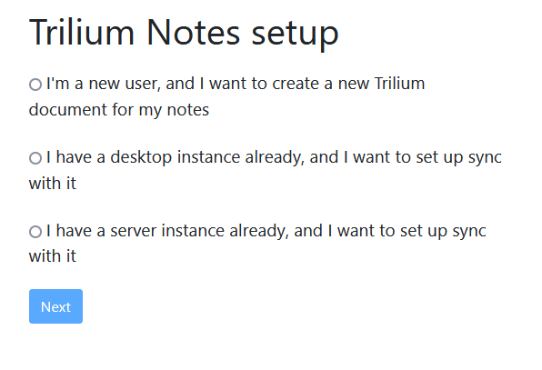
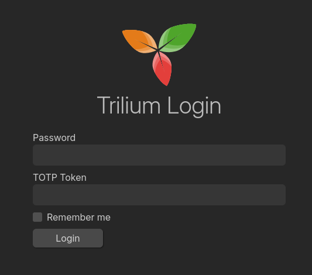
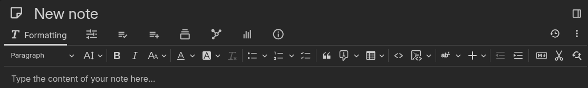
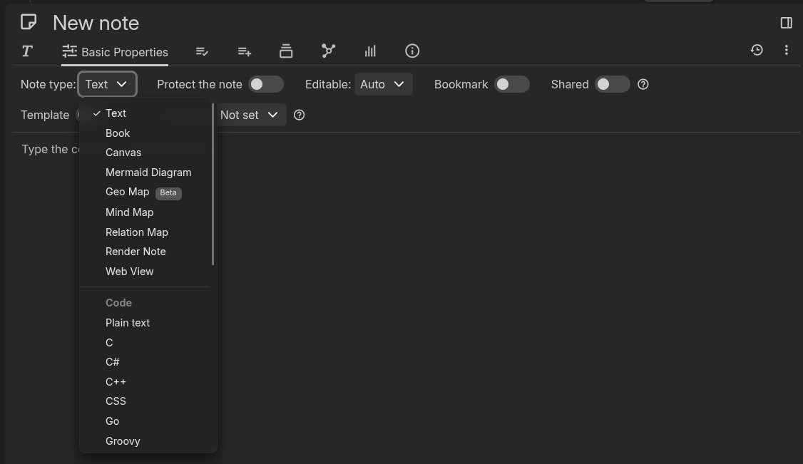

Wie meine Reise bis hin zu Trilium Notes aussah, habe ich ja [hier schon einmal ausführlich beschrieben](/posts/note-taking-app) – inklusive der vielen Tools, die vorher kamen und warum sie es am Ende nicht geworden sind.

In diesem Beitrag möchte ich euch nun kurz zeigen, wie ich Trilium Notes selbst installiert habe – in meinem Fall hinter Traefik. Außerdem teile ich noch ein paar Gedanken zur App selbst.

---

## Warum Trilium?

Trilium ist eine extrem vielseitige Notizverwaltungssoftware mit einem starken Fokus auf Struktur, Flexibilität und Funktionstiefe. Notizen lassen sich in verschachtelten Baumstrukturen organisieren, wobei jede Notiz auch mehrfach im Baum auftauchen kann – ein riesiger Vorteil, wenn man Inhalte kontextbezogen sortieren möchte.

---

**Was mich außerdem überzeugt hat:**

- WYSIWYG-Editor mit Support für Tabellen, Bilder, MathJax (Formeln) und Code mit Syntax-Highlighting

- Versionierung, Ende-zu-Ende-Verschlüsselung, Diagrammzeichnung mit Excalidraw

- Visuelle Darstellung von Beziehungen zwischen Notizen

- PWA-Unterstützung für mobile Nutzung – läuft bei mir reibungslos auf Android

- Live-Synchronisation zwischen Geräten – über einen selbst gehosteten Server via Docker

- Funktioniert komplett im Browser, fühlt sich aber wie eine native App an

---

#### Versionierung
Datum | Änderung
--|--
07-06-2025| Initialer Release

---

## Voraussetzungen

Bevor wir starten, stellt sicher, dass folgende Voraussetzungen erfüllt sind:

- [Docker & Docker Compose v2](/posts/server-setup#5-docker-und-docker-compose)
- [Traefik Setup](/posts/traefik)

---

## Ordner anlegen

Zuerst legen wir uns passende Ordner-Strukturen an.

```bash
mkdir -p /opt/containers/trilium
```

---

## Compose Datei anlegen

```bash
nano /opt/containers/trilium/compose.yml
```

```yaml title="compose.yml"
services:
  trilium:
    image: triliumnext/notes:latest
    restart: unless-stopped
    environment:
      - TRILIUM_DATA_DIR=/home/node/trilium-data
    volumes:
      - ./trilium-data:/home/node/trilium-data
      - /etc/timezone:/etc/timezone:ro
      - /etc/localtime:/etc/localtime:ro
    labels:
      - "traefik.enable=true"
      - "traefik.http.routers.trillium.entrypoints=websecure"
      - "traefik.http.routers.trillium.rule=Host(`notes.deine.cloud`)"
      - "traefik.http.routers.trillium.tls=true"
      - "traefik.http.routers.trillium.service=trillium"
      - "traefik.http.routers.trillium.tls.certresolver=cloudflare"
      - "traefik.http.services.trillium.loadbalancer.server.port=8080"
      - "traefik.docker.network=frontend"
    networks:
      - frontend
networks:
  frontend:
    external: true
``` 
**Noch anzupassen:**

* Eure Traefik URL =Host(`notes.deine.cloud`)

---

## Trilium starten

Nun starten wir den Container mittels folgendem Befehl:
```bash
docker compose -f /opt/containers/trilium/compose.yml up -d
```
Es kann ein paar Minuten dauern, bis der Container fertig gebaut ist.

Ruft nun im Browser die gewählte Domain auf und dann solltest du folgendes sehen.



Ich habe einen neuen Account erstellt und mich dann eingeloggt, aber man kann natürlich auch seine Desktop-Instanz oder per Browser auf einen entfernten Server synchronisieren, ziemlich cool!

Dann siehts bei mir so aus.



---

## Mein Setup

Ich habe als erstes die automatischen Backups aktiviert – damit werden täglich, wöchentlich und monatlich automatisch Backups erstellt.

Dann natürlich ein sicheres Passwort generieren lassen und MFA (Multi-Faktor-Authentifizierung) eingerichtet. Aktuell wird OIDC zwar unterstützt, aber nur mit Google als Anbieter. Weitere sollen jedoch bald folgen.

Ich schätze besonders das **Daily-Note-Feature** inklusive Kalenderansicht – das ist für mich ein echtes Highlight.

Das ganze Design von Trilium ist einfach schön. Es macht Spaß, sich durchzuklicken und das Programm richtig kennenzulernen. Besonders praktisch: der mitgelieferte Demo-Content. Damit bekommt man direkt ein Gefühl dafür, wie ein gefülltes Trilium aussieht und wie ein strukturierter Aufbau funktionieren kann.

Beim Öffnen einer Notiz habt ihr oben in der Menüleiste zuerst den Tab `Formatting` eingeblendet. Hier kann man alles einstellen, was für die Notizformatierung nötig ist.



Klickt ihr auf den zweiten Reiter, gelangt ihr zu den `Basic Properties`. Und hier wird's interessant: Unter `Note Types` könnt ihr festlegen, welchen Typ eure Notiz haben soll. Außerdem lässt sich die Notiz verschlüsseln, als Lesezeichen speichern oder sogar öffentlich teilen.



