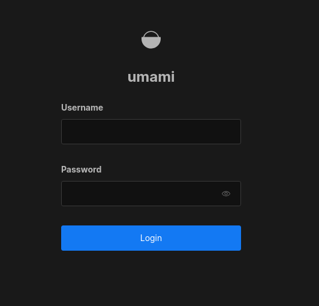
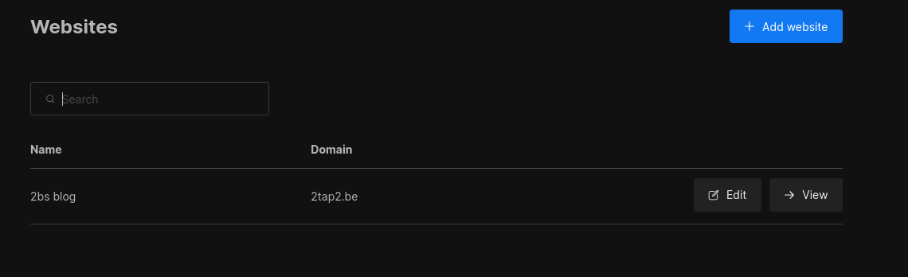
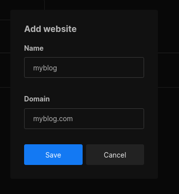
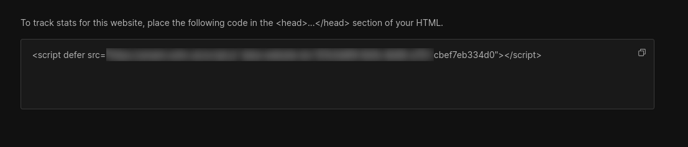

# 1. Intro

Umami ist eine leistungsstarke Analyse- und Tracking-Lösung, die es Webentitäten ermöglicht, ihre Website-Daten zu sammeln und zu analysieren. 
Mit Umami kannst du alle wichtigen Metriken wie Seitenbesuche, Besucher, Bounce-Rate, Traffic-Sources und vieles mehr sammeln und das ganz ohne die große Datenkrake
**Google** im Hintergrund.

Du behältst die volle Freiheit und Datenkontrolle, da du Umami selbst hosten kannst und die Software Open-Source ist.

Wenn du also z.B. so wie ich eine Webseite mit einem static Site Generator gebaut hast, dann kannst du trotzdem alle Metriken über deine Besucher sammeln und das mit nur sehr geringem Aufwand. 

Hier zeige ich dir, wie ich es für deinen Blog realisiert habe.

By the way... Mein Blog läuft mit dem **Astro Framework**.

---

## 2. Voraussetzungen

Bevor wir starten, stellt sicher, dass folgende Voraussetzungen erfüllt sind:

- [Docker & Docker Compose v2](/posts/server-setup#5-docker-und-docker-compose)
- [Traefik Setup](/posts/traefik)
- [Eine Webseite mit Astro Framework](https://astro.build)

---

## 3. Projektverzeichnis erstellen

Beginnen wir damit, ein Projektverzeichnis zu erstellen, in dem alle Konfigurationsdateien liegen:

```bash
mkdir /opt/containers/umami
cd /opt/containers/umami
```

---

## 4. Projektdateien erstellen

Erstellt eine neue Datei namens `docker-compose.yaml` mit folgendem Inhalt:

```shell
nano docker-compose.yaml
```

```yaml title="docker-compose.yaml"
---
services:
  umami:
    image: ghcr.io/umami-software/umami:postgresql-latest
    environment:
      DATABASE_URL: postgresql://umami:s1ch3r3sp4ssw0rt123@db:5432/umami
      DATABASE_TYPE: postgresql
      APP_SECRET: s1ch3r3sp4ssw0rt1337
    depends_on:
      db:
        condition: service_healthy
    labels:
      - "traefik.enable=true"
      - "traefik.http.routers.umami.entrypoints=websecure"
      - "traefik.http.routers.umami.rule=Host(`umami.deinedomain.de`)"
      - "traefik.http.routers.umami.tls=true"
      - "traefik.http.routers.umami.tls.certresolver=cloudflare"
      - "traefik.http.routers.umami.service=umami"
      - "traefik.http.services.umami.loadbalancer.server.port=3000"
      - "traefik.docker.network=frontend"
#      - "traefik.http.routers.umami.middlewares=middlewares-authelia@file" <---> Könnt ihr aktivieren, wenn ich das Dashboard mit 2FA Schützen wollt.
    networks:
      - frontend
    init: true
    restart: always
    healthcheck:
      test: ["CMD-SHELL", "curl http://localhost:3000/api/heartbeat"]
      interval: 5s
      timeout: 5s
      retries: 5
  db:
    image: postgres:15-alpine
    environment:
      POSTGRES_DB: umami
      POSTGRES_USER: umami
      POSTGRES_PASSWORD: s1ch3r3sp4ssw0rt123
    volumes:
      - umami-db-data:/var/lib/postgresql/data
    restart: always
    healthcheck:
      test: ["CMD-SHELL", "pg_isready -U $${POSTGRES_USER} -d $${POSTGRES_DB}"]
      interval: 5s
      timeout: 5s
      retries: 5
    networks:
      - frontend
volumes:
  umami-db-data:
networks:
  frontend:
    external: true
```

Bitte passe deine `Domain` in den Traefik Labels an und das `APP_SECRET` und das `POSTGRES_PASSWORD`.

Das könntest du ganz bequem mit diesem Befehl machen.

```shell
command -v pwgen &> /dev/null || { echo "Error: pwgen is not installed."; exit 1; } && DOCKER_COMPOSE_FILE="docker-compose.yaml" && [[ -f "$DOCKER_COMPOSE_FILE" ]] || { echo "Error: $DOCKER_COMPOSE_FILE not found."; exit 1; } && PASSWORD1=$(pwgen 32 1) && PASSWORD2=$(pwgen 32 1) && sed -i "s/s1ch3r3sp4ssw0rt123/$PASSWORD1/g; s/s1ch3r3sp4ssw0rt1337/$PASSWORD2/g" "$DOCKER_COMPOSE_FILE" && echo "Passwords replaced: $PASSWORD1, $PASSWORD2"
```

Der Befehl packt dir 2 Random Passwort mithilfe von `pwgen` automatisch in die `docker-compose.yaml`.

## 4. Umami starten

Jetzt nur noch den Container starten. Gebt dazu folgendes ein:

```shell
docker compose -f /opt/containers/umami/compose.yaml up -d
```

Jetzt können wir unsere Umami-Domain mal ansurfen und sollten vom Login-Screen begrüßt werden.



Default Login ist:

**Username: admin**

**Passwort: umami**

---

## 5. Umami einrichten

Die Einrichtung von Umami gestaltet sich relativ einfach. Unter Settings klicken wir auf 'Add Website'.



Gebe einen Namen und unsere Domain (ohne 'https://') ein und klicke auf 'Speichern'.



Und nun erhalten wir ein Snippet, das wir auf unserer Astro-Seite einbinden müssen, um sie zu tracken.



---

## 6. Astro Projekt anpassen

Zum Glück gibt es schon jemanden, der genau für unseren Fall ein Plugin auf [Github](https://github.com/thevrus/astro-umami-analytics)  
geschrieben hat und das lässt sich auch ganz schnell und unkompliziert installieren.

Um das Astro-Umami-Analytics-Plugin zu installieren, führe den folgenden Befehl im Projektverzeichnis aus.

```shell
npm install astro-umami-analytics
```

Dann füge ich in der `Layout.astro` noch folgendes hinzu:

```shell
---
import { Umami } from "astro-umami-analytics";
---
```

Und im Header Bereich das gerade eben erzeugte Snippet aus dem Umami Dashboard:

```js
<head>
  <!-- Other head elements -->
<script defer src="https://umami.deinedomain.de/script.js" data-website-id="67e3d4f9-3537-1337-123-cbef7eb334d0"></script>
</head>
```

Dann einmal den Runner anschmeißen und die Seite neu bauen lassen und fertig ist die selbst gehostete Google Analytics Alternative.

---

**Quellen:**

[Umami](https://umami.is/)

[Github](https://github.com/thevrus/astro-umami-analytics)  