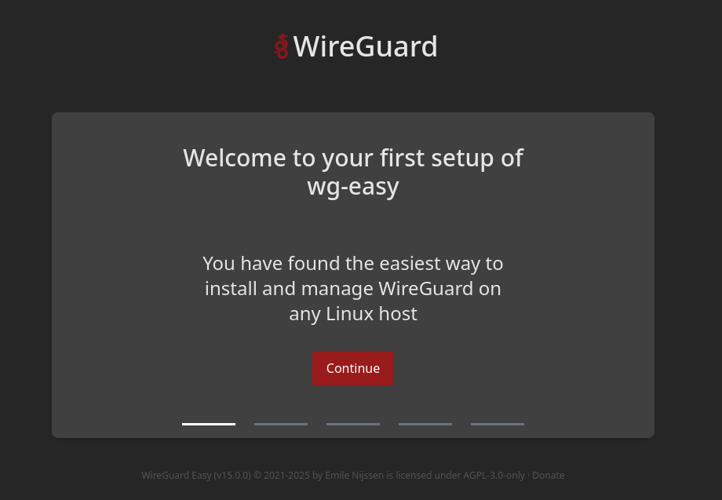
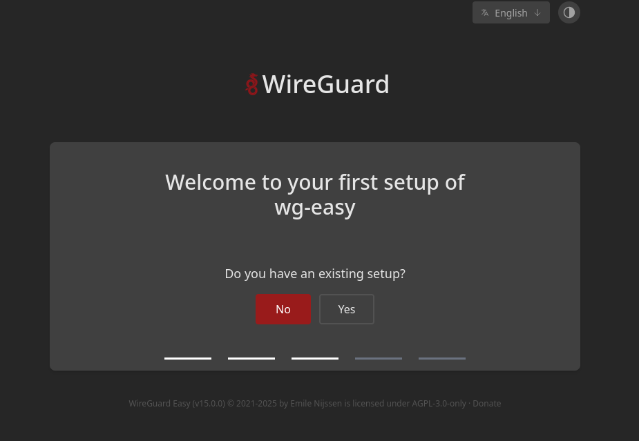
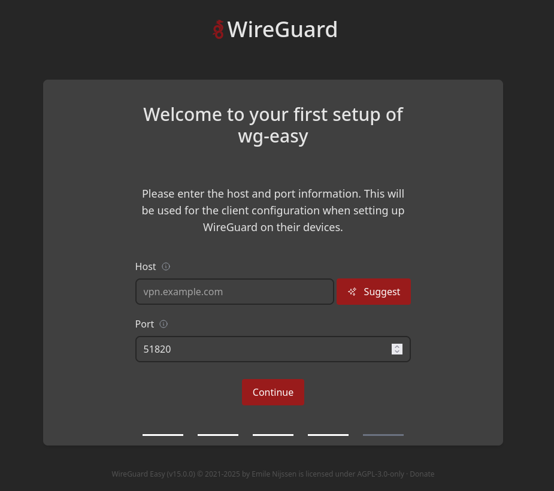
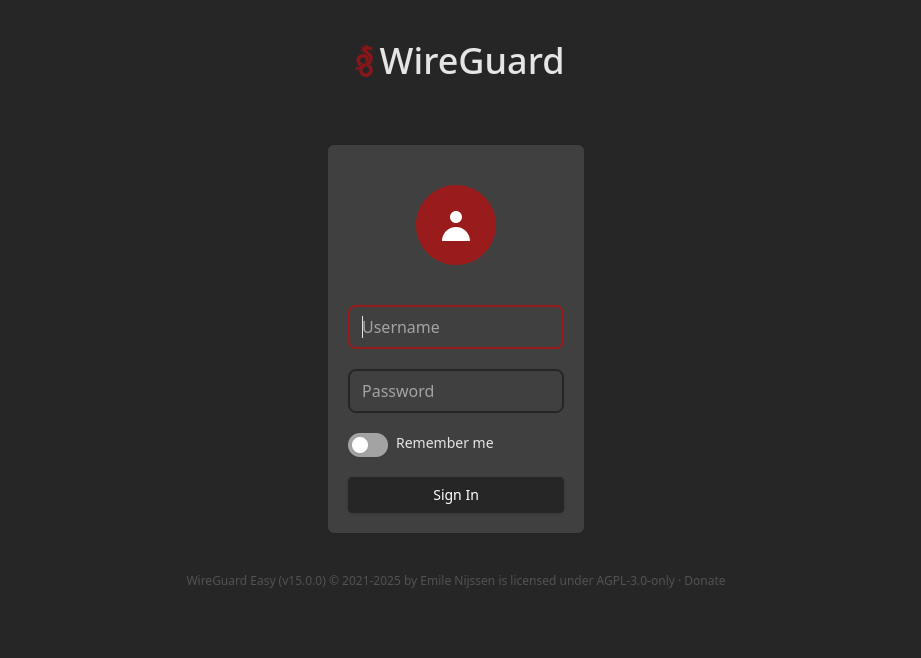

## Intro

WG-Easy ist ein extrem einfacher, aber leistungsstarker Wrapper für WireGuard. Es bietet ein benutzerfreundliches Webinterface, mit dem sich VPN-Zugänge verwalten lassen — ideal für Privatanwender, kleine Teams oder Entwickler-Umgebungen.

Mit **Version 15** wurde die UI vollständig überarbeitet. Das Interface ist modernisiert worden, bleibt aber vertraut. Neu sind unter anderem:

- Zwei-Faktor-Authentifizierung (2FA)
- One-Time-Links zum Herunterladen von `.conf`-Dateien
- Ablaufdatum für Tunnel
- Konfigurierbare Parameter wie Host, Port, DNS u.v.m. direkt im Webinterface

#### Versionierung
Datum | Änderung
--|--
02-06-2025 | Version 15 

---

## 2. Voraussetzungen

Stellt vor dem Start sicher, dass folgende Voraussetzungen erfüllt sind:

- [Docker & Docker Compose v2](/posts/server-setup#5-docker-und-docker-compose)
- [Traefik Setup](/posts/traefik)

---

## 3. Ordner anlegen

```bash
mkdir -p /opt/containers/wg-easy
```

---

## 4. Compose Datei anlegen

```bash
nano /opt/containers/wg-easy/compose.yml
```

```yaml title="compose.yml"
volumes:
  etc_wireguard:

services:
  wg-easy:
    #environment:
    #  Optional:
    #  - PORT=51821
    #  - HOST=0.0.0.0
    #  - INSECURE=false

    image: ghcr.io/wg-easy/wg-easy:15
    container_name: wg-easy
    networks:
      frontend: {}
      wg:
        ipv4_address: 10.42.42.42
        ipv6_address: fdcc:ad94:bacf:61a3::2a
    volumes:
      - etc_wireguard:/etc/wireguard
      - /lib/modules:/lib/modules:ro
    ports:
      - "51820:51820/udp"
      - "51821:51821/tcp"
    restart: unless-stopped
    cap_add:
      - NET_ADMIN
      - SYS_MODULE
      # - NET_RAW # ⚠️ Uncomment if using Podman
    sysctls:
      - net.ipv4.ip_forward=1
      - net.ipv4.conf.all.src_valid_mark=1
      - net.ipv6.conf.all.disable_ipv6=0
      - net.ipv6.conf.all.forwarding=1
      - net.ipv6.conf.default.forwarding=1
    labels:
      - "traefik.enable=true"
      - "traefik.http.routers.wg-easy.entrypoints=websecure"
      - "traefik.http.routers.wg-easy.rule=Host(`vpn.deinedomain.de`)"
      - "traefik.http.routers.wg-easy.tls=true"
      - "traefik.http.routers.wg-easy.tls.certresolver=cloudflare"
      - "traefik.http.routers.wg-easy.service=wg-easy"
      - "traefik.http.services.wg-easy.loadbalancer.server.port=51821"
      - "traefik.docker.network=frontend"
networks:
  frontend:
    external: true
  wg:
    driver: bridge
    enable_ipv6: true
    ipam:
      driver: default
      config:
        - subnet: 10.42.42.0/24
        - subnet: fdcc:ad94:bacf:61a3::/64

```

**Noch anzupassen:**

* Eure Traefik URL =Host(`vpn.deinedomain.de`)

---

## 5. WG-Easy starten

Nun starten wir den Container mit folgendem Befehl:

```bash
docker compose -f /opt/containers/wg-easy/compose.yml up -d
```

---

## 6. Webinterface aufrufen

Es dauert ca 1-2 Minuten bis der Container fertig gebaut ist, dann kannst du deine vergebene Domain aufrufen.



Du wirst nun initial durch die Einrichtung von wg-easy geführt.


Username und Passwort vergeben



Du könntest ein Backup deiner ältern wg-easy Instanz hier restoren.



Dann trägst du deinen Host hier noch ein.



Und das wars auch schon, nun kannst du dich einloggen.

---

## 7. Neue Funktionen in Version 15

Ein Überblick über die wichtigsten Neuerungen:

- **2FA**: Aktivierbar über die Accoutn Settings 
- **One-Time-Links**: Erzeuge zeitlich begrenzte Download-Links für `.conf`-Dateien
- **Ablaufdatum**: Tunnel können ein Verfallsdatum haben
- **Config im UI**: Hostname, Port, DNS, Allowed IPs, MTU, Keepalive direkt im Admin Panel änderbar

---

## 8. Fazit

WG-Easy ist eine super einfache Methode, um WireGuard aufzusetzen — mit Version 15 erhält das WebUI einen deutlichen Funktionszuwachs. Besonders hervorzuheben ist, dass die Benutzeroberfläche nun per Benutzername, Passwort und optionaler 2FA abgesichert werden kann – ein klarer Pluspunkt in Sachen Sicherheit.

Natürlich ist es auch möglich, das WebUI nur aus dem eigenen VPN heraus zugänglich zu machen, Tinyauth davorzuschalten oder Geo-Blocking zu aktivieren.
---

**Quellen:**

- [Github](https://github.com/wg-easy/wg-easy)
- [wg-easy Docs](https://wg-easy.github.io/wg-easy/latest/)

