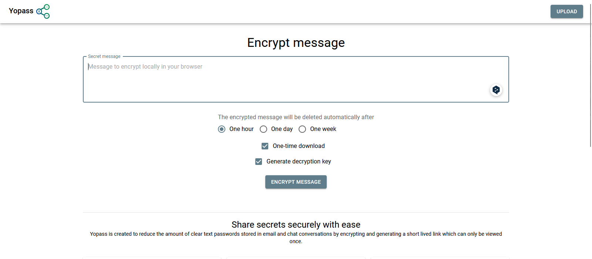

**Yopass** ist eine Open-Source-Plattform zur sicheren und schnellen Übermittlung vertraulicher Daten. Die Nachrichten werden direkt im Browser verschlüsselt, sodass Yopass selbst keinen Zugriff auf die Entschlüsselungsschlüssel hat. Nach der Verschlüsselung wird eine einmalige URL generiert, die automatisch nach einer festgelegten Zeit verfällt. Zudem bleibt der Absender anonym, da keine Rückverfolgbarkeit zur verschlüsselten Nachricht besteht. Durch diese einfache, aber effektive Struktur bietet Yopass eine sichere Alternative zur Weitergabe sensibler Informationen.

Mit Yopass lässt sich das Risiko reduzieren, dass vertrauliche Daten in alltäglichen Kommunikationskanälen verweilen und potenziell kompromittiert werden. Durch die **lokale Verschlüsselung im Browser**, die einmalige URL und die Anonymität des Dienstes bietet Yopass eine minimalistische, aber effektive Lösung, die den Anforderungen an schnelle und sichere Kommunikation gerecht wird.

Für all jene, die Passwörter, Zugangsdaten und andere sensible Informationen sicher teilen möchten, ist Yopass eine durchdachte und benutzerfreundliche Option.

## 1. Grundvoraussetzung

- [Docker & Docker Compose v2](/posts/server-setup#5-docker-und-docker-compose)
- [Traefik Setup](/posts/traefik)

---

## 2. Verzeichnis erstellen

Dazu gebt ihr folgenden Befehl ein:
```bash
mkdir -p /opt/containers/yopass
```

---

## 3. Docker Compose Datei erstellen

Nun erstellen wir unsere Docker Compose Datei.
```shell
nano /opt/containers/yopass/compose.yaml
```

**Fügt folgendes ein:**

```yaml title="compose.yml" 
---
services:
  memcached:
    image: memcached
    restart: always
    expose:
      - "11211"
    networks:
      - default
  yopass:
    image: jhaals/yopass
    restart: always
    command: "--memcached=memcached:11211 --port 80"
    environment:
      - VIRTUAL_HOST=yopass.deine.domain.de
      - MAX_LENGTH=8000000
    labels:
      - "traefik.enable=true"
      - "traefik.http.routers.yopass.entrypoints=websecure"
      - "traefik.http.routers.yopass.rule=Host(`yopass.deine.domain.de`)"
      - "traefik.http.routers.yopass.tls=true"
      - "traefik.http.routers.yopass.tls.certresolver=cloudflare"
      - "traefik.http.routers.yopass.service=yopass"
      - "traefik.http.services.yopass.loadbalancer.server.port=80"
      - "traefik.docker.network=frontend"
    networks:
      - frontend
networks:
  frontend:
    external: true
```


**Notwendige Anpassungen:**

1. Ihr müsst noch den Hostnamen anpassen: (yopass.deine.domain.de)
2. Ihr müsst den Virtual_Host anpassen: VIRTUAL_HOST=yopass.deine.domain.de

---

## 4. Yopass starten

Jetzt nur noch den Container starten. Gebt dazu folgendes ein:

```shell
docker compose -f /opt/containers/yopass/compose.yaml up -d
```


Nun geht ihr auf “yopass.deine.domain.de”. Dort solltet ihr jetzt folgendes sehen.



Yopass unterstützt den Upload kleiner Dateien, wie SSH-Schlüssel und Zertifikate, die sicher geteilt werden müssen. Der maximale Upload ist aktuell auf 1 MB beschränkt, eine Grenze, die sich durch die Variable max-length anpassen lässt. Diese Begrenzung stellt sicher, dass die Plattform für kleinere, sensible Dateien optimiert bleibt und eine schnelle, sichere Übertragung gewährleistet.

Quelle:

https://github.com/jhaals/yopass